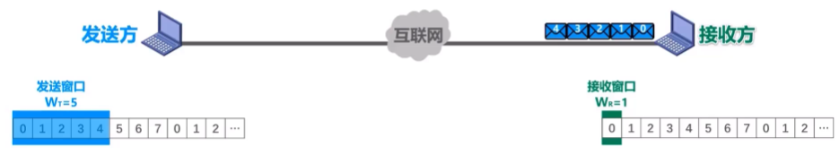

目录

# 第 1 章 概述

## 1.1 信息时代的计算机网络

## 1.2 因特网

### 网络、互联网与因特网的区别与关系

- 若干节点和链路互连形成**网络**

  

- 若干网络通过路由器互连形成**互联网**

  
  

- **因特网**：当今世界上最大的互联网

  
  

区别概念：

|          |   internet   |   Internet   |
| :------: | :----------: | :----------: |
| 名词属性 |   通用名词   |   专用名词   |
|   称呼   |    互联网    |    因特网    |
|   协议   | 任意通信协议 | TCP/IP协议族 |

### 因特网简介

- *发展阶段*

  

- ***因特网服务提供者(lnternet Service Provider，ISP)***

  

- *因特网已发展成为基于ISP的多层次结构的互连网络*

  

- *因特网的标准化工作*

**RFC （Request For Comments）请求评论**：任何人都可以从因特网上免费下载RFC文档，并随时对某个RFC文档发表意见和建议。

  

2011年10月取消草案标准阶段

  

- *因特网的管理机构*

  

- *因特网的组成*

  

## 1.3 电路交换、分组交换和报文交换

### 电路交换、分组交换和报文交换

#### 电路交换

1. 建立连接：分配通信资源；
2. 通话：一直占用通信资源；
3. 释放连接：归还通信资源。

  

$\color{red}{不适用于计算机之间的通信！}$：计算机之间的数据传送是**突发式**的，电路交换传输效率一般都会很低，真正用来传送数据的时间往往不到 10% 甚至 1%。

#### 分组交换

一对主机基于分组交换网的通信过程：

> 在实际因特网中：
>
> 1. 往往有大量主机在同时通信。
>
> 2. 在一台主机中也存在与网络通信的多个进程与其他主机不同的进程通信。

| 过程 |                                                              |        图解        |
| :--: | :----------------------------------------------------------- | :----------------: |
| $0$  | 主机 $H1$ 即将发送原始报文到主机 $H3$                        |  |
| $1$  | 主机 $H1$ 将原始报文划分成若干较小的等长数据段，添加必要控制信息组成的首部，构造出**分组** |  |
| $2$  | 分组经过各交换节点的**存储转发**，到达主机 $H3$              |  |
| $3$  | 主机 $H3$ 去掉首部，将各数据段组合还原成原始报文             |  |

具体存储转发过程：

  

- 发送方：
  - 构造分组
  - 发送分组
- 交换节点
  - 缓存分组
  - 转发分组
- 接收方
  - 接收分组
  - 还原报文

#### 报文交换

- 分组交换的前身。

- $\color{green}{报文被整个地发送}$，而不是拆分成若干个分组进行发送。
- $\color{green}{报文整体接收完成后}$才能查找转发表，将整个报文转发到下一个节点。

- 报文交换比分组交换带来的$\color{green}{转发时延要长很多}$，需要交换节点具有的$\color{green}{缓存空间大很多}$。

### 三种交换方式的对比

  

各自的优势对比

- 电路交换：连续传送大量的数据，并且数据传送时间远大于建立连接的时间。
- 报文交换和分组交换：传送计算机的突发数据【不需要建立连接（即预先分配通信资源)】。

### 1.4 计算机网络的定义和分类

#### 计算机网络的定义

**计算机网络早期的一个简单定义**：计算机网络是一个$\color{green}{互连}$，$\color{green}{自治}$的$\color{green}{计算机集合}$。

- 互连：有线链路或无线链路；
- 自治：主机之间独立运行；
- 计算机集合：至少需要两台以上的计算机。

**现阶段计算机网络的一个较好的定义**：计算机网络主要是由一些$\color{green}{通用的、可编程的硬件}$互连而成的，而这些硬件并非专门用来实现某一特定目的（例如，传送数据或视频信号）。这些可编程的硬件能够用来传送多种不同类型的数据，并能支持广泛的和日益增长的$\color{green}{应用}$。

- 可编程硬件：不限于计算机，而是包括了智能手机、具有网络功能的传感器以及智能家电等智能硬件（包含中央处理单元 $CPU$ ）
- 各类应用：计算机网络并非只用来传送数据，而是能够基于数据传送进而实现各种各样的应用，包括今后可能出现的各种应用。

#### 计算机网络的分类

| 分类标准 |                                                            |                    |
| -------- | ---------------------------------------------------------- | ------------------ |
| 交换方式 | 电路交换、分组交换、报文交换                               |  |
| 使用者   | 公有网（因特网）、专用网（军队、铁路、电力、银行）         |  |
| 传输介质 | 有线网络（双绞线网络、光纤网络等）、无线网络（WiFi）       |  |
| 覆盖范围 | 广域网（WAN），城域网（MAN）、局域网（LAN）、个域网（PAN） |  |
| 拓扑结构 | 总线型                                                     |  |
|          | 星型                                                       |  |
|          | 环型                                                       |  |
|          | 网状型                                                     |  |

### 1.5 计算机的性能指标

#### 速率

**比特（bit，b）**：计算机中数据量的基本单位。

> 一比特对应二进制数字中的一个 $1$ 或 $0$

其他数据量常用单位：

- 字节（$byte$，$B$）
- 千字节（$KB$）
- 兆字节（$MB$）
- 吉字节（$GB$）
- 太字节（$TB$）

换算关系（数据量单位中的K、M、G、T的数值分别为$2^{10}$，$2^{20}$，$2^{30}$，$2^{40}$。）：

| 数据量单位 | 换算关系                                                     |
| ---------- | ------------------------------------------------------------ |
| $b$        |                                                              |
| $B$        | $\mathrm{MB}=8 \mathrm{~b}$                                  |
| $KB$       | $\mathrm{KB}=\mathrm{K} \cdot \mathrm{B}=2^{10} \mathrm{~B}$ |
| $MB$       | $\mathrm{MB}=\mathrm{K} \cdot \mathrm{KB}=2^{20} \mathrm{~B}$ |
| $GB$       | $\mathrm{GB}=\mathrm{K} \cdot \mathrm{MB}=2^{30} \mathrm{~B}$ |
| $TB$       | $\mathrm{TB}=\mathrm{K} \cdot \mathrm{GB}=2^{40} \mathrm{~B}$ |

**速率/数据率/比特率**：数据的传送速率（每秒传送多少个比特）

基本单位：

- 比特/秒（$b/s$，$bit/s$，$bps$）

常用单位：

- 千比特/秒（$kb/s$，$kbps$）
- 兆比特/秒（$Mb/s$，$Mbps$）
- 吉比特/秒（$Gb/s$，$Gbps$）
- 太比特/秒（$Tb/s$，$Tbps$）

换算关系（速率单位中的K、M、G、T的数值分别为$10^{3}$，$10^{6}$，$10^{9}$，$10^{12}$。）：

| 速率单位 | 换算关系                                                     |
| -------- | ------------------------------------------------------------ |
| $b/s$    |                                                              |
| $kb/s$   | $\mathrm{kb} / \mathrm{s}=10^3 \mathrm{~b} / \mathrm{s}$     |
| $Mb/s$   | $\mathrm{Mb} / \mathrm{s}=\mathrm{k} \cdot \mathrm{kb} / \mathrm{s}=10^6 \mathrm{~b} / \mathrm{s}$ |
| $Gb/s$   | $\mathrm{Gb} / \mathrm{s}=\mathrm{k} \cdot \mathrm{Mb} / \mathrm{s}=10^9 \mathrm{~b} / \mathrm{s}$ |
| $Tb/s$   | $\mathrm{Tb} / \mathrm{s}=\mathrm{k} \cdot \mathrm{Gb} / \mathrm{s}=10^{12} \mathrm{~b} / \mathrm{s}$ |

【练习】有一个待发送的数据块，大小为 $100MB$ ，网卡的发送速率为 $100Mbps$ ，则网卡发送完该数据块需要多长时间?
$$
\frac{100 M B}{100 M b / s}=\frac{M B}{M b / s}=\frac{2^{20} B}{10^6 b / s}=\frac{2^{20} \times 8 b}{10^6 b / s}=8.388608 s
$$
$可以估算的时候直接约分：$
$$
\approx \frac{B}{b / s} =\frac{8 b}{b / s} =8 s
$$

#### 带宽

**带宽**：

- 模拟信号系统：某个信号所包含的各种不同频率成分所占据的频率范围。
  - 基本单位：$Hz$
  - 常用单位：$kHz$，$MHz$，$GHz$
- 计算机网络系统：用来表示网络的通信线路所能传送数据的能力，即在单位时间内从网络中的某一点到另一点所能通过的最高数据率。
  - 基本单位：$b/s$
  - 常用单位：$kb/s$，$Mb/s$，$Gb/s$，$Tb/s$

  

$$
\text { 数据传送速率 }=\min \{\text { 主机接口速率，线路带宽，交换机或路由器的接口速率 \} }
$$

> 木桶效应

#### 吞吐量

**吞吐量**：单位时间内通过某个网络或接口的实际数据量。

> 吞吐量受网络带宽的限制。

  

$$
\text { 吞吐量 }=20 \mathrm{Mb} / \mathrm{s}+600 \mathrm{~kb} / \mathrm{s}+1 \mathrm{Mb} / \mathrm{s}=21.6 \mathrm{Mb} / \mathrm{s}
$$

#### 时延

**时延/延迟/迟延**：数据（一个或多个分组，甚至是一个比特构成）从网络的一端传送到另一端所耗费的时间。

时延构成：

- **发送时延**：$\frac{\text { 分组长度 }(b)}{\text { 发送速率 }(b / s)}$
- **传播时延**：$\frac{\text { 信道长度 }(b)}{\text { 信号传播速率 }(b / s)}$
- **排队时延**：取决与网络通信量和路由器性能，无法计算
- **处理时延**：无法计算

  

考虑两台主机+一台路由器的情况：

  

| 过程 | 文字解释                                                     |   时延   | 图解               |
| :--: | :----------------------------------------------------------- | :------: | ------------------ |
| $0$  | 主机 $\longrightarrow$ 传输线路                              | 发送时延 |  |
| $1$  | 传输线路 $\longrightarrow$ 路由器                            | 传播时延 |  |
| $2$  | 分组在路由器排队缓存等待转发                                 | 排队时延 |  |
| $3$  | 路由器：检查分组首部是否误码、提取分组首部中的目的地址为分组查找相应的转发接口、修改分组首部的部分内容等 | 处理时延 |  |
| $4$  | 路由器 $\longrightarrow$ 传输线路                            | 发送时延 | 同$1$，逆过程      |
| $5$  | 传输线路 $\longrightarrow$ 主机                              | 传播时延 | 同$0$，逆过程      |

- 主机$A$给主机$B$发送单个分组的情况：也就是上述情况

  

- 主机$A$给主机$B$发送两个分组的情况（不考虑排队时延和处理时延）：

  

- 通过两端路由器相连，主机$A$给主机$B$发送四个分组的情况（不考虑排队时延和处理时延）：

  

【练习】在下图所示的采用“存储-转发”方式的分组交换网中，所有链路的数据传输速率$100Mbps$，分组大小为$1000B$，其中分组头大小为$20B$。若主机$H1$向主机$H2$发送一个大小为$980 000B$的文件，则在不考虑分组拆装时间和传播延迟的情况下，从$H1$发送开始到$H2$接收完为止，需要的时间至少是多少？

  

$最短路径：$

  

$需要的最小时长 = 所有分组的发送时延 +1 个分组的发送时延 \times 2$
$$
=\frac{1000 B}{100 M b / s} \times \frac{980000 B}{1000 B-20 B}+\frac{1000 B}{100 M b / s} \times 2=80.16 \mathrm{~ms}
$$
【练习】分别计算数据块长度为$100MB$和$1B$，信道带宽为$1Mb/s$，传送距离为$1000KM$，传输介质为光纤情况下的发送时延和传播时延。

$情况一：$
$$
\begin{aligned}
\text { 发送时延 } &=\frac{\text { 分组长度 }(b)}{\text { 发送速率 }(b / \mathrm{s})} \\
&=\frac{100 \times 2^{20} \times 8(b)}{10^6(b / s)}=838.8608(\mathrm{~s}) \\
\text { 传播时延 } &=\frac{\text { 信道长度 }(\mathrm{m})}{\text { 信号传播速率 }(\mathrm{m} / \mathrm{s})} \\
&=\frac{1000 \times 10^3(\mathrm{~m})}{2 \times 10^8(\mathrm{~m} / \mathrm{s})}=0.005(\mathrm{~s})
\end{aligned}
$$
$情况二：$
$$
\begin{aligned}
\text { 发送时延 } &=\frac{\text { 分组长度 }(b)}{\text { 发送速率 }(b / \mathrm{s})} \\
&=\frac{1 \times 8(\mathrm{~b})}{10^6(\mathrm{~b} / \mathrm{s})}=8 \times 10^{-6}(\mathrm{~s}) \\
\text { 传播时延 } &=\frac{\text { 信道长度 }(\mathrm{m})}{} \\
&=\frac{1000 \overline{\overline{1}} \text { 号传播速率 }(\mathrm{m} / \mathrm{s})}{2 \times 10^8(\mathrm{~m} / \mathrm{s})}=0.005(\mathrm{~s})
\end{aligned}
$$

#### 时延带宽积

**时延带宽积**：传播时延和带宽的乘积。

> 链路的时延带宽积 == 以比特为单位的链路长度

#### 往返时间

**往返时间（Round-Trip Time，RTT）**：从发送端发送数据分组开始，到发送端收到接收端发来的相应确认分组为止，总共耗费的时间。

#### 利用率

**链路利用率**：某条链路有百分之几的时间是被利用。

**网络利用率**：网络中所有链路利用率的加权平均。

- $D_0$：网络空闲时的时延
- $D$：网络当前的时延
- $U$：网络利用率

在理想的假定条件下：
$$
D=\frac{D_0}{1-U}
$$

  

> 一些大型ISP往往会控制信道利用率不超过50%。如果超过了就要进行扩容，增大线路的带宽。

#### 丢包率

**丢包率**：在一定时间范围内，传输过程中丢失的分组数量与总分组数量的比率。

分为网络丢包率、接口丢包率、节点丢包率、链路丢包率、路径丢包率。

分组丢失的两种情况：

1. 分组在传输过程中出现误码，被传输路径中的节点交换机（例如路由器）或目的主机检测出误码而丢弃。
2. 节点交换机根据丢弃策略主动丢弃分组。

$\color{red}{丢包率可以反映网络的拥塞情况}$

| 拥塞情况 | 丢包率            |
| -------- | ----------------- |
| 无拥塞   | $0$               |
| 轻度拥塞 | $1 \% \sim 4 \%$  |
| 严重拥塞 | $5 \% \sim 15 \%$ |

## 1.6 计算机网络体系结构

### 常用的三种计算机网络系统结构

  

$\color{red}{OSI标准失败的原因}$：

1. 专家没有实际经验完成标准时没有商业驱动力；
2. 协议实现过分复杂运行效率很低；
3. 标准的制定周期太长产品无法及时进入市场；
4. 层次划分不太合理有些功能在多个层次中重复出现。

$TCP/IP$ 体系结构

  

  

> $TCP/IP$ 体系结构：为了将不同的网络接口进行互连，其网络接口层并没有规定什么具体内容。
>
> 对于学习计算机网络体系就会缺少部分内容！

因此产生了**原理参考模型**：

  

### 计算机网络体系结构分层的必要性  

- $\color{pink}{应用层}$：解决通过应用进程的交互来实现特定网络应用的问题。
  - 通过应用进程间的交互完成特定的网络应用
  - 会话管理和数据表示
- $\color{blue}{运输层}$：解决进程之间基于网络的通信问题。
  - 如何解决进程之间基于网络的通信（$\color{red}{进程的标识，端口号}$）
  - 如何处理数据传输差错（$\color{red}{差错处理：可靠传输和不可靠传输}$）
- $\color{orange}{网络层}$：解决数据包在多个网络之间传输和路由的问题。
  - 如何标识网络和网络中各主机（$\color{red}{网络和主机共同编址，IP地址}$）
  - 路由器转发分组（$\color{red}{路由选择协议，路由器和转发表}$）
- $\color{green}{数据链路层}$：解决数据包在一个网络或一段链路上传输的问题。
  - 如何标识网络中各主机（$\color{red}{主机编址，MAC地址}$）
  - 如何从比特流中区分出地址和数据（$\color{red}{数据封装格式}$）
  - 如何协调网络中各主机争用总线（$\color{red}{媒体接入控制}$）——总线型网络
  - 以太网交换机的实现（$\color{red}{自学习和转发帧}$）——有线网络
  - 如何检测数据是否误码（$\color{red}{差错检测}$）——无限网络和有线网络
  - 如何处理数据传输差错（$\color{red}{差错处理：可靠传输和不可靠传输}$）——无限网络和有线网络
  - 接收方控制发送方注入网络的数据量（$\color{red}{流量控制}$）——无限网络和有线网络
- $\color{grey}{物理层}$：解决使用何种信号来表示比特0和1的问题。
  - 采用什么$\color{red}{传输媒体}$
  - 采用什么$\color{red}{物理接口}$
  - 采用什么$\color{red}{信号}$表示比特0和1

### 计算机网络体系结构分层思想举例

【练习】假设$OSI$参考模型的应用层欲发送$400B$的数据（无拆分)，除物理层和应用层之外，其他各层在封装$PDU$时均引入$20B$的额外开销，则应用层数据传输效率约为（）。
A.80%
B.83%
C.87%
D.91%

  

$$
\frac{400 B}{400 B+20 B+20 B+20 B+20 B+20 B}=80 \%
$$

### 计算机网络体系结构中的专用术语

**实体**：任何可发送或接受信息的硬件或软件进程。

**对等实体**：通信双方相同层次中的实体。

  

**协议**：控制两个对等实体在“水平方向”进行”逻辑通信”的规则的集合。

三要素：

- **语法**：定义所交换信息的格式。
- **语义**：定义通信双方索要完成的操作。
- **同步**：定义通信双方的时序关系。

**服务**：在协议的控制下，两个对等实体在水平方向的逻辑通信使得本层能够向上一层提供服务。

> 要实现本层协议，还需要使用下一层所提供的服务。

  

> 协议是“水平”的，而服务是“垂直”的。
>
> 下层的协议对上层的实体是“透明”的：实体看得见下层提供的服务，不知道实现该服务的具体协议。

**服务访问点$SAP$**：在同一系统中相邻两层的实体交换信息的逻辑接口，被用于区分不同的服务类型。

**服务原语$SP$**：上层要使用下层所提供的服务，必须通过与下层交换一些命令。

**协议数据单元$PDU$**：对等层次之间传送的数据包。

**服务数据单元$SDU$**：不同层次之间交换的数据包。

  

# 第 2 章 物理层

## 2.1 物理层概述

### 物理层要实现的功能

$\color{red}{在各种传输媒体上传输0和1,给上层（数据链路层）提供透明传输比特流的服务。}$

  

### 物理层接口特性

- $\color{green}{机械特性}$
  - 形状和尺寸
  - 引脚数目和排列
  - 固定和锁定装置
- $\color{green}{电气特性}$
  - 信号电压的范围
  - 阻抗匹配的情况
  - 传输速率
  - 距离限制
- $\color{green}{功能特性}$
  - 规定接口电缆的各条信号线的作用
- $\color{green}{过程特性}$
  - 规定在信号线上传输比特流的一组操作过程，包括各信号间的时序关系

举例：

| 物理特性 | 图示               | 说明                                     |
| -------- | ------------------ | ---------------------------------------- |
| 机械特性 |  | RJ45插座的机械特性                       |
| 电气特性 |  | 100BASE-T快速以太网的电气特性            |
| 功能特性 |  | 100BASE-T快速以太网使用的RJ45的T568B标准 |

## 2.2 物理层下面的传输媒体

### 传输媒体的分类

**传输媒体/传输介质/传输媒介**：计算机网络设备之间的物理通路。

> 传输媒体并不包含在计算机网络体系结构中。

- $\color{green}{导向型传输媒体（固体媒体）}$
  - 同轴电缆
  - 双绞线
  - 光纤
- $\color{green}{非导向型传输媒体（自由空间）}$
  - 无线电波
  - 微波
  - 红外线
  - 大气激光
  - 可见光

### 导向型传输媒体

- $\color{green}{同轴电缆}$
  - 基带同轴电缆（$50 \Omega$）：用于数字传输，在早期局域网中广泛使用。
  - 宽带同轴电缆（$75 \Omega$）：用于模拟传输，目前主要用于有线电视的入户线。

  

> 同轴电缆价格较贵且布线不够灵活和方便。随着技术的发展和集线器的出现，在局域网领域基本上都采用双绞线作为传输媒体。

- $\color{green}{双绞线}$
  - 无屏蔽双绞线$UTP$电缆

    

      
    

  - 屏蔽双绞线$STP$电缆（在上面的基础上增加一层金属丝作为屏蔽层）

    

      
    

> 绞合的作用：减少相邻导线间的电磁；干扰抵御部分来自外界的电磁干扰。

| 双绞线类别 | 带宽   | 线缆特点                  | 典型应用                    |
| ---------- | ------ | ------------------------- | --------------------------- |
| 3          | 16MHz  | 2对4芯双绞线              | 传统以太网10Mb/s；模拟电话  |
| 4          | 20MHz  | 4对8芯双绞线              | 曾用于令牌局域网            |
| 5          | 100MHz | 与4类相比增加了绞合度     | 传输速率不超过100Mb/s的应用 |
| 5E         | 125MHz | 与5类相比衰减更小         | 传输速率不超过1Gb/s的应用   |
| 6          | 250MHz | 与5类相比改善了串扰等性能 | 传输速率高于1Gb/s的应用     |
| 7          | 600MHz | 使用屏蔽双绞线            | 传输速率高于10Gb/s的应用    |

- $\color{green}{光纤}$

> 光纤通信利用光脉冲在光纤中的传递来进行通信。
>
> 由于可见光的频率非常高(约为$10^8MHz$量级)，因此一个光纤通信系统的传输带宽远大于目前其他各种传输媒体的带宽。

  

略...

### 非导向型传输媒体

## 2.3 传输方式

### 串行传输和并行传输

**串行传输**：在一条数据传输线路上逐比特依次传输。

**并行传输**：发送端和接收端有多条数据传输线路，构成数据的多个比特被分别安排在不同的数据线路同时传输。

> 如果在一条数据传输线路的速率相同，并行传输的数据传输速率是串行传输速率的$n$倍

**数据总线宽度$n$**：取决于并行传输所采用的数据传输线路的数量，常见有8位，16位，32位以及64位。

  
  

### 同步传输和异步传输

以单向传输为例

**同步传输**：数据块以比特流的形式传输，字节之间没有间隔，没有起始位和终止位。

  

> 接收方在比特信号的中间时刻进行采样
>
> 收发双方时钟频率的误差积累造成比特信号采样时刻的严重偏移

收发双方时钟同步方法：

1. **外同步**：在收发双方之间增加一条时钟信号线
2. **内同步**：发送端将时钟信号编码到发送数据中一起发送（曼彻斯特编码）。

**异步传输**：数据块以比特流的形式传输，字节之间存在间隔，每个字节有起始位和终止位。

  

### 单向通信、双向交替通信和双向同时通信

**单向通信/单工**：只能有一个方向的通信，没有双向的交互。

  

**双向交替通信/半双工**：通信双方都可以发送信息和接收信息，但对于任何一方，发送信息和接收信息不能同时进行。

  

**双向同时通信**：通信双方可以同时发送信息和接收信息。

  

## 2.4 编码与调制

### 编码与调制的基本概念

**消息**：需要计算机处理的$\color{文字、图片、音频、视频等内容}{波形}$。

**数据**：运算消息的$\color{red}{实体}$。

**信号**：$\color{red}{数据}$的电磁表现。

**基本频带信号（基带信号）**：由信源发出的$\color{red}{原始信号}$。

> **数字基带信号**：计算机发出的数字信号。
>
> 基带信号往往包含较多的低频成分。

需要调制基带信号，有两种调制方式：

1. **基带调制**：对数字基带信号的$\color{red}{波形}$进行变换，调制后的信号仍然是数字基带信号，使其能在$\color{red}{数字信道}$中传输。

   > 编码：数字信号转换为另一种形式的数字信号。

   举例：以太网采用的曼彻斯特编码、4B/5B、8B/10B

2. **带通调制**：对数字基带信号的$\color{red}{频率范围}$搬移到较高的频段并转换为模拟信号，使其能在$\color{red}{模拟信道}$中传输。

   举例：Wi-Fi采用的CCK/DssS/OFDM调制

**码元**：在使用时间域的波形表示信号时，代表不同离散数值的基本波形。

  

### 常用编码方式

 比特流：$1 1 1 1 1 1 1 0 0 1 0 1$

  

- **双极性不归零编码**（编码效率高，存在同步问题）

  - 信号为正电平表示$1$，信号为负电平表示$0$；

  - 信号在每个码元期间不会回归到零电平；

  - *接收方如何判断连续的是多少个码元？*

    答：需要给收发双方添加一条时钟信号线，发送方通过数据信号线给接收方发送数据的同时，还通过时钟信号线给接收方发送时钟信号。接收方按照接收到的时钟信号的节拍，对数据信号线上的信号进行采样。（计算机网络一般不会采用时钟信号线）

- **双极性归零编码**（编码效率低，不存在同步问题）

  - 信号为正电平表示$1$，信号为负电平表示$0$；

  - 信号在每个码元期间会回归到零电平；

  - 接收方只要在信号归零后采样即可。

    > **“自同步”信号**：将时钟信号用“归零”方式编码在了数据之内。

- **曼彻斯特编码**

  - 信号在每个码元的中间时刻发生跳变；
  - 信号在码元的电平正跳变表示$1$还是$0$，负跳变表示$0$还是$1$，可以自行定义；
  - 信号的电平跳变既表示时钟信号也表示数据。

- **差分曼彻斯特编码**

  - 信号在每个码元的中间时刻发生跳变；
  - 信号在码元的开始处有电平跳变：无跳变表示$1$，有跳变表示$0$；
  - 信号的电平跳变仅表示时钟信号不表示数据。

差分曼彻斯特编码信号比曼彻斯特编码信号：

- 在传输大量连续$1$或连续$0$的情况下变化少；

- 在噪声干扰环境下检测有无跳变比检测跳变方向更不容易出错；
- 在传输介质接线错误导致高低电平翻转的情况下仍然有效。

$\color{red}{因此差分曼彻斯特编码信号比曼彻斯特编码信号更易于检测。}$

#### 基本的带通调制方法和混合调制方法

  

- **调幅（AM）**：无载波表示$0$，有载波表示$1$。
- **调频（FM）**：频率$f1$表示$0$，频率$f2$表示$1。$

- **调相（PM）**：相位$0^{\circ}$表示$0$，相位$1^{\circ}$表示$1$。

- **混合调制方式（QAM）**：频率与相位是相关的，所以载波的相位和频率可以结合调制。

> $12$种相位 && $2$种振幅 $\longrightarrow$ $16$种码元
>
> $\log _2 16=4$ $\longrightarrow$ 每个码元对应表示$4$个比特（采用格雷码编码）

  

## 2.5 信道的极限容量

### 造成信号失真的主要因素

  

- **码元的传输速率：传输速率越高，信号经过传输后的失真就越严重。**
- 信号的传输距离：传输距离越远，信号经过传输后的失真就越严重。
- 噪声干扰：干扰越大，信号经过传输后的失真就越严重。
- 传输媒体的质量：质量越差，信号经过传输后的失真就越严重。

|      |                                                          |                    |
| ---- | -------------------------------------------------------- | ------------------ |
| $0$  | 期望得到的数字信号                                       |  |
| $1$  | 选择一个与数字信号频率相同的模拟信号作为基波             |  |
| $2$  | 基波与3次谐波叠加形成近似方波的数字信号                  |  |
| $3$  | 基波经过多次更高频率谐波的叠加形成高度接近数字信号的波形 |  |

> 信道上传输的数字信号 $\longrightarrow$ 多个频率的模拟信号进行多次叠加后形成的方波

如果数字信号中的高频分量在传输时受到衰减甚至不能通过信道，则接收端接收到的波形前沿和后沿就变得不那么陡峭，每一个码元所占的时间界限也不再明确。这样，在接收端接收到的信号波形就失去了码元之间的清晰界限，这种现象称为**码间串扰**。

如果信道的频带越宽，则能够通过的信号的高频分量就越多，那么码元的传输速率就可以更高，而不会导致码间串扰。然而，信道的频率带宽是有上限的，不可能无限大。因此，码元的传输速率也有上限。

### 奈氏准则（码元传输速率）

$$
\text { 理想低通信道的最高码元传输速率 }=2 W （\text { Baud }）
$$

- $W$：信道的频率带宽（单位为$Hz$)
- $Baud$：波特（码元/秒）

------

> 只要码元传输速率不超过根据奈氏准则计算出的上限，就可以避免码间串扰。
>
> 奈氏准则给出的是理想低通信道的最高码元传输速率，它和实际信道有较大的差别。一个实际的信道所能传输的最高码元传输速率，要明显低于奈氏准则给出的上限值。

**码元传输速率/波特率/调制速率/波形速率/符号速率**

码元传输速率与比特率有一定的关系:

- 当$1$个码元只携带$1$比特的信息量时，波特率（码元/秒）与比特率（比特/秒）在数值上是相等的。
- 当$1$个码元携带$n$比特的信息量时，波特率（码元/秒）转换成比特率（比特/秒）时，数值要乘以$n$。

*Q：尽管奈氏准则限制了最高码元传输速率，但是只要采用技术更为复杂的信号调制方法，让码元可以携带更多的比特，岂不是可以无限制地提高信息的传输速率吗？*

A：回答是否定的。因为在实际的信道中会有噪声，噪声是随机产生的，其瞬时值有时会很大，这会影响接收端对码元的识别，并且噪声功率相对于信号功率越大，影响就越大。

### 香农公式（信息传输速率）

带宽受限且有高斯白噪声干扰的信道的极限信息传输速率：
$$
C=W \log _2\left(1+\frac{S}{N}\right)
$$

- C：信道的极限信息传输速率（单位为$b/s$)
- W：信道的频率带宽（单位为$Hz$)
- $\frac{S}{N}$：信道的信噪比（无量纲的比值）

> 信道的频率带宽$W$或信道中的信噪比$S/N$越大，信道的极限信息传输速率$C$就越高。
>
> 实际信道不可能无限制地提高频率带宽W或信道中的信噪比$S/N$。
>
> 实际信道中能够达到的信息传输速率，要比香农公式给出的极限传输速率低不少。因为在实际信道中，信号还要受到其他一些损伤（例如各种脉冲干扰和信号衰减等）在香农公式中并未考虑。

$\color{red}{综合奈氏准则和香农定理，}$

$\color{red}{在信道的频率带宽W一定的情况下，要想提高信息的传输速率，就必须采用多元制(更复杂的调制技术)，并努力提高信道中的信噪比。}$

【练习1】在无噪声情况下，若某通信链路的带宽为$3kHz$，采用$4$个相位，每个相位具有$4$种振幅的$QAM$调制技术，则该通信链路的最大数据传输速率是（）。

A.12kbps

B.24kbps

C.48kbps

D.96kbps

 $理想通信链路的最高码元传输速率=2 \times 3 \mathrm{k}=6 \mathrm{k}（码元/秒）$

$采用4个相位，每个相位具有4种振幅的QAM调制技术可以调制出16种不同的基本波形（码元）。$

$采用二进制对这16种不同的码元进行编码，需要使用4个比特(log16=4)。$

$\longrightarrow 每个码元可以携带的信息量为4个比特。$
$$
\text { 通信链路的最大数据传输速率 }=6 \mathrm{k} \text { (码元/秒) } \times 4 \text { (比特/码元) }=24 \mathrm{k} \text { (比特/秒) }=24 \mathrm{kbps}
$$
【练习2】若某通信链路的数据传输速率为$2400bps$，采用$4$相位调制，则该链路的波特率是（）。

A.600波特

B.1200波特

C.4800波特

D.9600波特

$采用4个相位，可以调制出4种不同的基本波形（码元）。$

$采用二进制对这4种不同的码元进行编码，需要使用2个比特(log4=2)。$

$\longrightarrow 每个码元可以携带的信息量为2个比特。$

$\text { 通信链路的最大数据传输速率 }=码元传输速率 \text { (码元/秒) } \times 2 \text { (比特/码元) }=2400{bps}$
$$
\text { 码元传输速率/波特率 }=1200 \text { 波特 }
$$
【练习3】下列因素中，不会影响信道数据传输速率的是（）。

A.信噪比

B.频率带宽

C.调制速度

D.信号传播速度

> D

【练习4】若某链路的频率带宽为$8kHz$，信噪比为$30dB$，该链路实际数据传输速率约为理论最大数据传输速率的$50\%$，则该链路的实际数据传输速率约是（）。

A.8kbps

B.20kbps

C.40kbps

D.80kbps

$10 \cdot \log _{10}\left(\frac{S}{N}\right)（dB）=30（dB）$

$\longrightarrow \frac{S}{N}=1000$
$$
\text { 通信链路的实际数据传输速率 }==8 k \cdot \log _2(1+1000) \approx 8 k \cdot \log _2\left(2^{10}\right)=80 k b p s
$$
【练习5】若信道在无噪声情况下的极限数据传输速率不小于信噪比为$30dB$条件下的极限数据传输速率，则信号的状态数至少是（）。

A.4

B.8

C.16

D.32

$\text { 设信号状态数 (可调制出的不同基本波形或码元数量) 为 } x$

$\longrightarrow 每个码元可以携带的信息量为\log _2 x个比特。$

$通信链路在无噪声情况下的极限数据传输速率=2W \text { (码元/秒) } \times \log _2 x \text { (比特/码元) }=2 W \log _2 X\text { (比特/秒) }$

$通信链路在30dB情况下的极限数据传输速率=W log _2(1+1000) \text { (比特/秒) }$

根据题意列出不等式
$$
2 W \log _2 x \geq W \log _2(1+1000)
$$

$$
x \geq 32
$$

## 2.6 信道复用技术

### 信道复用技术的基本原理

  

**复用**：在一条传输媒体上同时传输多路用户的信号。

> 在某条传输媒体上建立多条通信信道条件：一条传输媒体的传输容量大于多条信道传输的总容量。
>
> 通过复用技术，充分利用传输媒体的带宽。

### 常见的信道复用技术

**频分复用FDM**：所有用户占用不同的频带资源发送数据。

  

> **时分复用TDM**：所有用户在不同的时间占用相同的频带资源发送数据。

**TDM帧**：时分复用的各用户对应的时隙

  

**波分复用WDM**：光的$\color{red}{频分复用}$。根据频分复用的设计思想，可在一根光纤上同时传输多个频率（波长）相近的光载波信号，实现基于光的频分复用技术。

> **密集波分复用DWDM**：目前可以在一根光纤上复用80路或更多路的光载波信号。

  

**码分复用CDM**：码分多址CDMA，在扩频通信技术的基础上发展起来的一种无线通信技术。CDMA的所有用户可以在相同的时间占用相同的频带进行通信。

**码片**：CDMA将每个比特时间划分为$m$个更短的时间片。取值一般为$64$或$128$。

CDMA中的每个站点都被指派一个唯一的**$m$比特码片序列**。

- 某个站要发送比特$1$，则发送它自己的$m$比特码片序列；
- 某个站要发送比特$0$，则发送它自己的$m$比特码片序列的反码。

*举例：假设给某个站指派的$8$比特码片序列为$01011001$*

- 该站发送比特$1$：发送自己的$8$比特码片序列$01011001$
- 该站发送比特$0$：发送自己的$8$比特码片序列$01011001$的反码$10100110$

将码片序列中的比特$0$记为$-1$，而比特$1$记为$+1$，可写出码片序列相应的**码片向量**。
$$
(-1,+1,-1,+1,+1,-1,-1,+1)
$$

> 如果有两个或多个站同时发送数据，则信道中的信号就是这些站各自所发送一系列码片序列或码片序列反码的叠加。

为了从信道中分离出每个站的信号，给每个站指派码片序列时，必须遵循以下规则:

- 分配给每个站的码片序列必须各不相同，实际常采用伪随机码序列。
- 分配给每个站的码片序列必须相互正交，即各码片序列相应的码片向量之间的规格化内积为$0$。

------

令向量$A$表示站$A$的码片向量，向量$B$表示站$B$的码片向量。

两个不同站$A$和$B$的码片序列相互正交，就是向量$A$与向量$B$的**规格化内积**为0，如下式所示：
$$
A \cdot B=\frac{1}{m} \sum_{i=1}^m A_i B_i=0
$$
*举例：假设给$A$站指派的$8$比特码片序列为$01011001$，给$B$站指派的$8$比特码片序列为$00110101$*

- $A$站码片向量：$(-1,+1,-1,+1,+1,-1,-1,+1)$
- $B$站码片向量：$(-1,-1,+1,+1,-1,+1,-1,+1)$

规格化内积为$0$

其他推论

1. $$
   A \cdot \bar{B}=\frac{1}{m} \sum_{i=1}^m A_i \bar{B}_i=-\frac{1}{m} \sum_{i=1}^m A_i B_i=-0=0
   $$

2. $$
   A \cdot A=\frac{1}{m} \sum_{i=1}^m A_i A_i=\frac{1}{m} \sum_{i=1}^m A_i^2=\frac{1}{m} \sum_{i=1}^m(\pm 1)^2=1
   $$

3. $$
   A \cdot \bar{A}=\frac{1}{m} \sum_{i=1}^m A_i \overline{A_i}=-\frac{1}{m} \sum_{i=1}^m A_i A_i=-1
   $$

  

$\color{red}{各手机用自己的码片向量与收到的叠加后的码片向，做规格化内积运算}$

$A$：$(A+\bar{B}) \cdot A=A \cdot A+A \cdot \bar{B}=1+0=1$

> 运算结果为$1$，表明收到的是比特$1$

$B$：$(A+\bar{B}) \cdot B=A \cdot B+\bar{B} \cdot B=0+(-1)=-1$

> 运算结果为$-1$，表明收到的是比特$0$

$C$：$(A+\bar{B}) \cdot C=A \cdot C+\bar{B} \cdot C=0+0=0$

> 运算结果为$0$，表明没有收到信息

  

- $A$：

  - $\frac{(+1) \times(+2)+(-1) \times 0+(+1) \times 0+(-1) \times(-2)}{4}=1$

  - $\frac{(+1) \times 0+(-1) \times(+2)+(+1) \times(-2)+(-1) \times 0}{4}=-1$

  - $\frac{(+1) \times 0+(-1) \times(-2)+(+1) \times(+2)+(-1) \times 0}{4}=1$

    $\longrightarrow$ $101$

- $B$：

  - $\frac{(+1) \times(+2)+(+1) \times 0+(-1) \times 0+(-1) \times(-2)}{4}=1$

  - $\frac{(+1) \times(0)+(+1) \times (+2)+(-1) \times (-2)+(-1) \times(0)}{4}=1$

  - $\frac{(+1) \times(0)+(+1) \times (-2)+(-1) \times (+2)+(-1) \times(0)}{4}=0$

    $\longrightarrow$ $110$

- $C$：

  - $\frac{(+1) \times(+2)+(+1) \times 0+(+1) \times 0+(+1) \times(-2)}{4}=0$

  - $\frac{(+1) \times(0)+(+1) \times (+2)+(+1) \times (-2)+(+1) \times(0)}{4}=0$

  - $\frac{(+1) \times(0)+(+1) \times (-2)+(+1) \times (+2)+(+1) \times(0)}{4}=0$

    没有数据

【练习】站点$A、B、C$通过$CDMA$共享链路，$A、B、C$的码片序列分别是$(1,1,1,1)$、$(1,-1,1,-1)$和$(1,1,-1,-1)$。若$C$从链路上收到的序列是$(2,0,2,0,0,-2,0,-2,0,2,0,2)$，则$C$收到$A$发送的数据是（）。

A. 000

B. 101

C. 110

D. 111

$C接收到的是A，B发送过来的叠加码片$

$C收到A发送的数据：将接收到的叠加码片与A的码片序列进行规格化内积操作：$
$$
\begin{aligned}
(1,1,1,1) \cdot(2,0,2,0)=(1 \times 2+1 \times 0+1 \times 2+1 \times 0) \div 4=1
\end{aligned}
$$

$$
\begin{aligned}
(1,1,1,1) \cdot(0,-2,0,-2)=(1 \times 0+1 \times(-2)+1 \times 0+1 \times(-2)) \div 4=-1
\end{aligned}
$$

$$
\begin{aligned}
(1,1,1,1) \cdot(0,2,0,2)=(1 \times 0+1 \times 2+1 \times 0+1 \times 2) \div 4=1
\end{aligned}
$$
$\longrightarrow$ $101$

# 第 3 章 数据链路层

## 3.1 数据链路层概述

### 数据链路层在网络体系结构中所处的地位

  

### 链路、数据链路和帧

**链路**：从一个节点到相邻节点的一段物理线路（有线或无线)，而$\color{red}{}$中间没有任何其他的交换节点。

**数据链路**：基于链路的，当在一条链路上传送数据时，除$\color{green}{需要链路本身}$，还需要$\color{green}{一些必要的通信协议}$来控制这些数据的传输，把实现这些协议的硬件和软件加到链路上，就构成了数据链路。

计算机中的**网络适配器（网卡）**和其相应的软件驱动程序就实现了这些协议。

> 一般的网络适配器都包含了物理层和数据链路层这两层的功能。

  

**帧**：数据链路层对等实体之间在水平方向进行逻辑通信的协议数据单元$PDU$。

  

## 3.2 数据链路层的三个重要问题

以太网$V2$的MAC帧(最大长度$1518B$)：

  

$PPP$帧：

  

*区别帧？*

$\color{red}{在帧的数据载荷部分恰好出现与了与帧首部和尾部中的标志字段取值相同的标志字段}$，在不采取任何措施的情况下，会出现帧定界错误。

  

如果不解决上述问题，则数据链路层就会对上层交付的$PDU$的内容有所限制，即$PDU$中不能包含帧定界符。

如果能够采取措施，使得数据链路层对上层交付的$PDU$的内容没有任何限制，就好像数据链路层不存在一样，就称其为**透明传输**。

------

发送方给接收方发送帧，由于通信链路的不理想，不可避免产生失真甚至出现误码。

*接收方接收到帧后如何知道帧中出现了误码？*

**差错检测**：发送方的数据链路层采用某种检错技术根据帧的内容讨算出一个检错码，将检错码填入帧尾部（帧尾部序列$FCS$），发送方通过检错码检测帧在传输过程中是否出现了误码。

- 奇偶校验
- 循环冗余校验

  

------

| 数据链路层提供服务类型 | 处理                                       |
| ---------------------- | ------------------------------------------ |
| 不可靠传输服务         | 直接丢弃有误码的帧                         |
| 可靠传输服务           | 实现发送方发送什么，接收方最终都能正确收到 |

### 3.2.1 封装成帧和透明传输

**封装成帧**：数据链路层给上层交付的协议数据单元添加帧头和帧尾使之成为帧。

  

通过物理层将帧转换成电信号发送到传输媒体，
*接收方的数据链路层如何从物理层变付的比特流中提取出一个个的帧?*

通过物理层将帧转换成电信号发送到传输媒体

  

- $PPP$帧的格式：帧头帧尾包含帧定界标志

  

- 以太网$V2$的$MAC$帧格式：添加前导码（包括有前同步码和帧开始定界符）&&帧间间隔时间（不需要帧结束定界符）

  
  

**透明传输**：数据链路层对上层交付的传输数据没有任何限制，就好像数据链路层不存在一样。

- 面向字节的物理链路使用**字节填充（或称字符填充）**的方法实现透明传输；

  - 每出现一个定界符或转义字符在其前面插入一个转义字符（$ESC$）

    > **转义字符（$ESC$）**：一个字节，对应十进制27。

    

      
    

- 面向比特的物理链路使用**比特填充**的方法实现透明传输。

  - 采用零比特填充法，保证定界符在帧中的唯一性

    

      
    

【练习】$HDLC$协议对$0111110001111110$组帧后对应的比特串为（）

A. $011111000011111010$

B. $011111000111110101111110$

C. $01111100011111010$

D. $011111000111111001111101$

$高级数据链路控制协议HDLC采用帧头和帧尾中的标志字段作为帧定界符，其值为01111110$

$HDLC为了实现“透明传输”，采用“零比特填充法”(每5个连续1后面插入一个比特0) ;$

$A$

### 3.2.2 差错检测

$\color{red}{为了提高帧的传输效率，应当使帧的数据部分的长度尽可能大些。}$

考虑到差错控制等多种因素，每一种数据链路层协议都规定了帧的数据部分的长度上限，即**最大传送单元$MTU$**

**比特差错**：实际的通信链路都不是理想的，比特在传输过程中可能会产生差错：$1$可能会变成$0$，而$0$也可能变成$1$。

**误码率$BER$**：在一段时间内，传输错误的比特占所传输比特总数的比率。

**帧检验序列$FCS$**：接收方的数据链路层用来检查帧在传输过程中是否产生了误码。

  

**奇偶校验**：在待发送的数据后面添加$1$位奇偶校验位，使整个数据（包括所添加的校验位在内）中“1”的个数为奇数（奇校验）或偶数（偶校验)。

- 如果有奇数个位发送误码，则奇偶性发生变化，可以检查出误码；
- 如果有偶数个位发生误码，则奇偶性不发生变化，不能检查出误码（捡漏）；

  

**循环冗余校验$CRC$**：

1. 收发双方约定**生成多项式$G(x)$**

2. 发送方基于待发送的数据和生成多项式计算**差错检测码（冗余码）**，将其添加到待传输数据的后面一起传输；

3. 接收方通过生成多项式来计算收到的数据是否产生了误码。

|       发送方        |       接收方        |
| :-----------------: | :-----------------: |
|  |  |

生成多项式：
$$
\begin{aligned}
G(x) &=x^4+x^2+x+1 \\
&=1 \cdot x^4+0 \cdot x^3+1 \cdot x^2+1 \cdot x^1+1 \cdot x^0
\end{aligned}
$$
生成多项式各项系数构成的比特串：$10111$

常用的生成多项式

$C R C-16=x^{16}+x^{15}+x^2+1$
$C R C-C C I T T=x^{16}+x^{12}+x^5+1$
$C R C-32=x^{32}+x^{26}+x^{23}+x^{22}+x^{16}+x^{12}+x^{11}+x^{10}+x^8+x^7+x^5+x^4+x^2+x+1$

【练习】待发送的信息为$101001$，生成多项式为$G(x)=x^3+x^2+1$，计算余数。

1. 构造被除数：待发送信息后面添加生成多项式最高次数个$0$；$101001000$

2. 构造除数：生成多项式各项系数构成的比特串；$1101$

3. 做“除法”：

   

     
   

4. 检查余数：余数的位数应与生成多项式最高次数相同，如果位数不够，则在余数前补$0$来凑足位数。$001$

   

     
   

> $101001001$

【练习】待发送的信息为$101101001$，生成多项式为$G(x)=x^3+x^2+1$，判断传输是否误码。

1. 构造被除数：$101101001$

2. 构造除数：生成多项式各项系数构成的比特串；$1101$

3. 做“除法”：

   

     
   

4. 检查余数：
   1. 余数为$0$，可认为传浦过程无误码；
   2. 余数不为$0$，可认为传输过程产生误码。

------

检错码只能检测出帧在传输过程中出现了差错，但是无法定位错误，纠正错误。

循环冗余校验$CRC$有很好的检错能力（漏检率非常低)，虽然计算比较复杂，但非常易于用硬件实现，因此被广泛应用于数据链路层。

在计算机网络中通常采用我们后续课程中将要讨论的检错重传方式来纠正传输中的差错，或者仅仅是丢弃检测到差错的帧，这取决于数据链路层向其上层提供的是可靠传输服务还是不可靠传输服务。

### 3.2.3 (1)可靠传输的相关基本概念

$\color{red}{数据链路层向上层提供的服务类型：}$

- **不可靠传输服务**：仅仅丢弃有误码的帧，其他什么也不做；
- **可靠传输服务**：想办法实现发送端发送什么，接收端就收到什么。

一般情况下，有线链路的误码率比较低，为了减小开销，并不要求数据链路层向上提供可靠传输服务。即使出现了误码，可靠传输的问题由其上层处理。

无线链路易受干扰，误码率比较高，因此要求数据链路层必须向上层提供可靠传输服务。

**传输差错**：从整个计算机网络体系结构来看，分为

- 比特差错（数据链路层）
- 分组丢失
- 分组失序
- 分组重复

可靠传输服务并不局限于数据链路层，其他各层均可选择实现可靠传输服务。

  

- 网络接口层：选择实现可靠传输服务。
  - 802.11无线局域网：要求链路层实现可靠传输
  - 以太网：不要求数据链路层实现可靠传输服务
- 网际层：IP向上层提供无连接、不可传输服务。
- 运输层：不同协议不同实现。
  - $TCP$向其上层提供面向连接的可靠传输服务
  - $UDP$向其上层提供无连接的不可靠传输服务

------

  

$\color{red}{这三种可靠传输实现机制的基本原理并不仅限于数据链路层,可以应用到计算机网络体系结构的各层协议中。}$

### 3.2.3 (2)可靠传输的实现机制-停止-等待协议（SW）

  

1. 发送方给接收方发送数据分组
2. 接收方收到数据分组进行差错检测
   1. 没有误码，接受该数据分组，发送确认分组$ACK$
   2. 发现误码，丢失该数据分组，发送否认分组$NCK$
3. 发送方收到$ACK$/$NAK$
   1. $ACK$：接着发送下一个数据分组
   2. $NAK$：重新发送上一个数据分组

*1. 超时重传：发送方发送的数据分组丢失*

**超时重传**：在发送方发送完一个数据分组时，启动一个超时计时器。若到了超时计时器所设置的重传时间而发送方仍收不到接收方的任何$ACK$或$NAK$，则重传原来的数据分组。

  

> 一般可将重传时间选为略大于“从发送方到接收方的平均往返时间”。

*2. 确认丢失：接收方发送的$ACK$或$NAK$丢失*

> 对于停止-等待协议，由于发送方每发送一个数据分组就停止等待，只要保证每发送一个新的数据分组，其发送序号与上次发送的数据分组的序号不同就可以了，因此用一个比特来编号就够了。

  

*3. 确认迟到：发送方收到接收方发送的$ACK$或$NAK$时间超过计划重传时间*

  

------

- 接收端检测到数据分组有误码时，将其丢弃并等待发送方的超时重传。但对于误码率较高的点对点链路，为使发送方尽早重传，也可给发送方发送$NAK$分组。
- 为了让接收方能够判断所收到的数据分组是否是重复的，需要给数据分组编号。由于停止-等待协议的停等特性，只需$1$个比特编号就够了，即编号$0$和$1$。
- 为了让发送方能够判断所收到的$ACK$分组是否是重复的，需要给$ACK$分组编号，所用比特数量与数据分组编号所用比特数量一样。数据链路层一般不会出现$ACK$分组迟到的情况，因此在数据链路层实现停止-等待协议可以不用给$ACK$分组编号。
- 超时计时器设置的重传时间应仔细选择。一般可将重传时间选为略大于“从发送方到接收方的平均往返时间”。
  - 在数据链路层点对点的往返时间比较确定，重传时间比较好设定。
  - 在运输层端到端往返时间非常不确定，设置合适的重传时间有时并不容易。

  

**停止等待的信道利用率**：
$$
U=\frac{T_D}{T_D+R T T+T_A}
$$

> $T_A$可以忽略不计

$$
U=\frac{T_D}{T_D+R T T}
$$

- 当往返时延$RTT$远大于数据帧发送时延$T_D$时（例如使用卫星链路），信道利用率非常低。
  - 若出现重传，则对于传送有用的数据信息来说，信道利用率还要降低。

> 为了克服停止等待协议利用率低的缺点，产生了另外两种协议回退$N$帧协议和选择重传协议。

【练习】主机甲采用停-等协议向主机乙发送数据，数据传输速率使$3kbps$，单向传播延时是200ms,忽略确认帧的传输延时。当信道利用率等于$40\%$时，数据帧的长度为（）

A. 240比特

B. 400比特

C. 480比特

D. 800比特

  

$$
信道利用率=\frac{数据帧发送时延}{数据帧发送时延+端到端往返时延}
$$

$设数据帧长度为x比特$
$$
40 \%=\frac{\frac{x b}{3 k b / s}}{\frac{x b}{3 k b / s}+2 \times 200 m s}
$$
$\longrightarrow$ $x=800比特$

### 3.2.3 (3)可靠传输的实现机制-回退N帧协议（GBN）

  

$\color{red}{采用流水线传输可提高信道利用率。}$

1. 采用$3$个比特给分组编号
2. 发送窗口的尺寸$W_T$取值范围：$1<W_r \leq 2^3-1$，这里取$W_T=5$
3. 接收窗口的尺寸$W_R=1$

  

- 无差错情况

|      |                                                              |                     |
| ---- | ------------------------------------------------------------ | ------------------- |
| $0$  | 发送方将序号落在发送窗口内的$01234$号数据分组连续发送        |  |
| $1$  | 接收方按序接收$01234$号数据分组                              |  |
| $2$  | 接收方每接收一个数据分组，接收窗口向前滑动一个位置，并给发送方发送针对所接收分组的确认分组 |  |
| $3$  | 发送方按序接收$01234$号数据分组确认分组                      |  |
| $4$  | 发送方每接收一个数据分组的确认分组，发送窗口向前滑动一个位置。 |  |
| $5$  | 发送方将删除缓存中已经收到确认的数据分组；接收方择机将已经接收的数据分组交付上层处理 |  |

**累计确认**：接收方不一定要对收到的数据分组逐个发送确认，而是可以在收到几个数据分组后（由具体实现决定）对按序到达的最后一个数据分组发送确认。

> $ACKn$表示序号为$n$及以前的所有数据分组都已正确接收。

|      |                                                              |                     |
| ---- | ------------------------------------------------------------ | ------------------- |
| $0$  | 发送方将序号落在发送窗口内的$01234$号数据分组连续发送        |  |
| $1$  | $01234$号数据分组依次到达接收方                              |  |
| $2$  | 接收方接收完数据分组$0$和$1$后，接收窗口向前滑动$2$个位置，并给发送方发送针对所接收的最后一个分组的确认分组$ACK1$ |  |
| $3$  | 接收方接收完数据分组$2$、$3$和$4$后，接收窗口向前滑动$3$个位置，并给发送方发送针对所接收的最后一个分组的确认分组$ACK4$ |  |
| $4$  | $ACK1$在传输过程中丢失                                       |  |
| $5$  | $ACK4$正常到达发送方                                         |  |
| $6$  | 发送方接收$ACK4$（序号为$4$及之前的数据分组已被接收方正确接收了），发送窗口向前滑动$5$个位置 |  |
| $7$  | 发送方将删除缓存中已经收到确认的数据分组；接收方择机将已经接收的数据分组交付上层处理 |  |

> 即使确认分组丢失，发送方也可能不必重传！同时减少接收方的开销、减少网络资源的占用。

- 有差错的情况

|      |                                                              |                     |
| ---- | ------------------------------------------------------------ | ------------------- |
| $0$  | 发送方将序号落在发送窗口内的$56701$号数据分组连续发送        |  |
| $1$  | $56701$号数据分组依次到达接收方                              |  |
| $2$  | 接收方通过$5$号数据分组中的检错码发现了错误，丢弃该分组      |  |
| $3$  | 接收方接收窗口序号与数据分组不匹配，丢弃其余分组             |  |
| $4$  | 接收方给发送方发送针对所接收的最后一个分组的确认分组$ACK4$（每丢弃一个发送一个） |  |
| 5    | $ACK4$正常到达发送方                                         |  |
| 6    | 发送方接收$ACK4$，又因为序号为$4$及之前的数据分组已被接收方正确接收了，不等超时计时器超时就立刻开始重传（收到几个重复$ACK$开始重传由具体实现来决定） |  |

**回退N帧**：在本例中，尽管序号为$6.7.0.1$的数据分组正确到达接收方。但由于$5$号数据分组误码不被接受。它们也“受到牵连”而不被接受，发送方还要重传这些数据分组。

> 当通信线路质量不好时，回退$N$帧协议的信道利用率并不比停止-等待协议高。

*如果发送窗口尺寸$W_T$超过其取值范围上限？*

|      |                                                              |                     |
| ---- | ------------------------------------------------------------ | ------------------- |
| $0$  | 发送方将序号落在发送窗口内的$01234567$号数据分组连续发送     |  |
| $1$  | $01234567$号数据分组依次到达接收方                           |  |
| $2$  | 接收方依次接收完数据分组$01234567$，后，接收窗口向前滑动$8$个位置，并给发送方发送针对所接收的最后一个分组的确认分组$ACK7$ |  |
| $3$  | $ACK7$在传输过程中丢失                                       |  |
| $4$  | 超时计时器超时，发送方重传$01234567$号数据分组               |  |
| $5$  | 重传的$01234567$号数据分组依次到达接收方                     |  |
| $6$  | 接收方按序接收重传的$01234567$号数据分组                     |  |

$\color{red}{接收方无法分辨新、旧数据分组！}$

【练习】数据链路层使用后退$N$帧$（GBN）$协议，发送方已经发送了编号为$0$到$7$的帧。当计时器超时时，若发送方只收到$0、2、3$号帧的确认，则发送方需要重发的帧数是（）

A. 2

B. 3

C. 4

D. 5

$C$

### 3.2.3 (4)可靠传输的实现机制-选择重传协议（SR）

$\color{red}{为了进一步提高性能，可设法只重传出现误码的数据分组。}$

1. 采用$3$个比特给分组编号
2. 发送窗口的尺寸$W_T$取值范围：$1<W_r \leq 2^3-1$，这里取$W_T=4$
3. 接收窗口的尺寸$W_R=4$

  

|      |                                                              |                     |
| ---- | ------------------------------------------------------------ | ------------------- |
| $0$  | 发送方将序号落在发送窗口内的$0123$号数据分组连续发送         |  |
| $1$  | $0123$号数据分组依次到达接收方                               |  |
| $2$  | $2$号数据分组丢失                                            |  |
| $3$  | 接收方依次接收完数据分组$01$后，接收窗口向前滑动$2$个位置，并给发送方发送针对所接收分组的确认分组$ACK0$和$ACK1$ |  |
| $4$  | 接收方依次接收完数据分组$3$后，并给发送方发送针对所接收分组的确认分组$ACK3$ |  |
| $5$  | $ACK0$、$ACK1$和$ACK3$陆续到达发送方                         |  |
| $6$  | （接收方每接收完一个数据分组，接收窗口向前滑动$1$个位置）发送方依次接收完$ACK0$和$ACK1$后，发送窗口向前滑动$2$个位置 |  |
| $7$  | 发送方将序号落在发送窗口内的$45$号数据分组连续发送           |  |
| $8$  | 发送方将删除缓存中已经收到确认的数据分组$01$；接收方择机将已经接收的数据分组$01$交付上层处理 |  |
| $9$  | 发送方接收完$ACK3$，记录数据分组$3$已收到                    |  |
| $10$ | $45$号数据分组依次到达接收方                                 |  |
| $11$ | 接收方依次接收完数据分组$45$后，并给发送方发送针对所接收分组的确认分组$ACK4$和$ACK$5 |  |
| $12$ | 超时计时器超时，发送方重传$2$号数据分组                      |  |
| $13$ | 发送方接收完$ACK4$和$ACK5$，记录数据分组$45$已收到           |  |
| $14$ | $2$号数据分组依次到达接收方                                  |  |
| $15$ | 接收方接收完数据分组$2$后，接收窗口向前滑动$4$个位置，并给发送方发送针对所接收分组的确认分组$ACK2$ |  |
| $16$ | $ACK2$到达发送方                                             |  |
| $17$ | 发送方接收完$ACK2$，发送窗口向前滑动$4$个位置                |  |
| $18$ | 发送方将删除缓存中已经收到确认的数据分组$012345$；接收方择机将已经接收的数据分组$012345$交付上层处理 |  |

- 发送方发送窗口尺寸：$1<W_T \leq 2^{(n-1)}$
  - $W_T=1$，停止-等待协议
  - $W_T>2^{(n-1)}$，接收方无法分辨新，旧分组

- 接收方接收窗口尺寸：$1<W_R \leq W_T$
  - $W_R=1$，回退$N$帧协议
  - $W_R>W_T$，无意义

*如果发送窗口尺寸$W_T$以及$W_R$超过其取值范围上限？*

|      |                                                              |                     |
| ---- | ------------------------------------------------------------ | ------------------- |
|      | 发送方将序号落在发送窗口内的$01235$号数据分组连续发送        |  |
|      | $01234$号数据分组依次到达接收方                              |  |
|      | 接收方依次接收完数据分组$01234$后，接收窗口向前滑动$5$个位置，并给发送方发送针对所接收分组的确认分组$ACK0$到$ACK4$ |  |
|      | 发送方接收完$ACK0$到$ACK4$，但$ACK0$丢失，记录数据分组$1234$已收到 |  |
|      | 超时计时器超时，发送方重传$0$号数据分组                      |  |
|      | 重传的$0$号数据分组到达接收方                                |  |
|      | 接收方接收重传的$0$号数据分组                                |  |

$\color{red}{接收方无法分辨新、旧数据分组！}$

【练习】数据链路层采用选择重传协议（$SR$）传输数据，发送方已发送了$0$到$3$号数据帧，现已收到$1$号帧的确认，而$0、2$号帧依次超时，则此时需要重传的帧数是（）

A. 1

B. 2

C. 3

D. 4

$B$

## 3.3 点对点协议PPP

## 3.4 共享式以太网

### 3.4.1 网络适配器和MAC地址

### 3.4.2 (1)CSMA/CD协议的基本原理

### 3.4.2 (2)共享式以太网的争用期、最小帧长和最大帧长

### 3.4.2 (3)共享式以太网的退避算法和信道利用率

### 3.4.3 使用集线器的共享式以太网

### 3.4.4 在物理层扩展以太网

### 3.4.5 在数据链路层扩展以太网(1)—网桥的主要结构和基本原理

### 3.4.5 在数据链路层扩展以太网(2)—透明网桥的自学习和转发帧的过程以及生成树协议STP

## 3.5 交换式以太网

### 3.5.1 以太网交换机

### 3.5.2 共享式以太网和交换式以太网的对比

## 3.6 以太网的MAC帧格式

### 3.7.1 虚拟局域网VLAN概述

### 3.7.2 虚拟局域网VLAN的实现机制

## 3.8 以太网的发展

### 3.9.1 802.11无线局域网的组成

### 3.9.2 802.11无线局域网的物理层

### 3.9.3 (1)802.11无线局域网的数据链路层——使用CSMA/CA协议（而不使用CSMA/CD协议）

### 3.9.3 (2)802.11无线局域网的数据链路层——CSMA/CA协议的基本工作原理

### 3.9.4 802.11无线局域网的MAC帧

# 第 4 章 网络层

# 第 5 章 运输层

# 第 6 章 应用层

# 第 7 章 网络安全

