- [第 3 章 数据链路层](#第-3-章-数据链路层)
  - [3.1 数据链路层概述](#31-数据链路层概述)
    - [数据链路层在网络体系结构中所处的地位](#数据链路层在网络体系结构中所处的地位)
    - [链路、数据链路和帧](#链路数据链路和帧)
  - [3.2 数据链路层的三个重要问题](#32-数据链路层的三个重要问题)
    - [3.2.1 封装成帧和透明传输](#321-封装成帧和透明传输)
    - [3.2.2 差错检测](#322-差错检测)
    - [3.2.3 (1)可靠传输的相关基本概念](#323-1可靠传输的相关基本概念)
    - [3.2.3 (2)可靠传输的实现机制-停止-等待协议（SW）](#323-2可靠传输的实现机制-停止-等待协议sw)
    - [3.2.3 (3)可靠传输的实现机制-回退N帧协议（GBN）](#323-3可靠传输的实现机制-回退n帧协议gbn)
    - [3.2.3 (4)可靠传输的实现机制-选择重传协议（SR）](#323-4可靠传输的实现机制-选择重传协议sr)
  - [3.3 点对点协议PPP](#33-点对点协议ppp)
  - [3.4 共享式以太网](#34-共享式以太网)
    - [3.4.1 网络适配器和MAC地址](#341-网络适配器和mac地址)
      - [网络适配器](#网络适配器)
      - [MAC地址](#mac地址)
    - [3.4.2 (1)CSMA/CD协议的基本原理](#342-1csmacd协议的基本原理)
    - [3.4.2 (2)共享式以太网的争用期、最小帧长和最大帧长](#342-2共享式以太网的争用期最小帧长和最大帧长)
    - [3.4.2 (3)共享式以太网的退避算法和信道利用率](#342-3共享式以太网的退避算法和信道利用率)
    - [3.4.3 使用集线器的共享式以太网](#343-使用集线器的共享式以太网)
    - [3.4.4 在物理层扩展以太网](#344-在物理层扩展以太网)
    - [3.4.5 在数据链路层扩展以太网(1)—网桥的主要结构和基本原理](#345-在数据链路层扩展以太网1网桥的主要结构和基本原理)
    - [3.4.5 在数据链路层扩展以太网(2)—透明网桥的自学习和转发帧的过程以及生成树协议STP](#345-在数据链路层扩展以太网2透明网桥的自学习和转发帧的过程以及生成树协议stp)
  - [3.5 交换式以太网](#35-交换式以太网)
    - [3.5.1 以太网交换机](#351-以太网交换机)
    - [3.5.2 共享式以太网和交换式以太网的对比](#352-共享式以太网和交换式以太网的对比)
  - [3.6 以太网的MAC帧格式](#36-以太网的mac帧格式)
    - [3.7.1 虚拟局域网VLAN概述](#371-虚拟局域网vlan概述)
    - [3.7.2 虚拟局域网VLAN的实现机制](#372-虚拟局域网vlan的实现机制)
  - [3.8 以太网的发展](#38-以太网的发展)
    - [3.9.1 802.11无线局域网的组成](#391-80211无线局域网的组成)
    - [3.9.2 802.11无线局域网的物理层](#392-80211无线局域网的物理层)
    - [3.9.3 (1)802.11无线局域网的数据链路层——使用CSMA/CA协议（而不使用CSMA/CD协议）](#393-180211无线局域网的数据链路层使用csmaca协议而不使用csmacd协议)
    - [3.9.3 (2)802.11无线局域网的数据链路层——CSMA/CA协议的基本工作原理](#393-280211无线局域网的数据链路层csmaca协议的基本工作原理)
    - [3.9.4 802.11无线局域网的MAC帧](#394-80211无线局域网的mac帧)

# 第 3 章 数据链路层

## 3.1 数据链路层概述

### 数据链路层在网络体系结构中所处的地位

  

### 链路、数据链路和帧

**链路**：从一个节点到相邻节点的一段物理线路（有线或无线)，而$\color{red}{}$中间没有任何其他的交换节点。

**数据链路**：基于链路的，当在一条链路上传送数据时，除$\color{green}{需要链路本身}$，还需要$\color{green}{一些必要的通信协议}$来控制这些数据的传输，把实现这些协议的硬件和软件加到链路上，就构成了数据链路。

计算机中的**网络适配器（网卡）**和其相应的软件驱动程序就实现了这些协议。

> 一般的网络适配器都包含了物理层和数据链路层这两层的功能。

  

**帧**：数据链路层对等实体之间在水平方向进行逻辑通信的协议数据单元$PDU$。

  

## 3.2 数据链路层的三个重要问题

以太网$V2$的MAC帧(最大长度$1518B$)：

  

$PPP$帧：

  

*区别帧？*

$\color{red}{在帧的数据载荷部分恰好出现与了与帧首部和尾部中的标志字段取值相同的标志字段}$，在不采取任何措施的情况下，会出现帧定界错误。

  

如果不解决上述问题，则数据链路层就会对上层交付的$PDU$的内容有所限制，即$PDU$中不能包含帧定界符。

如果能够采取措施，使得数据链路层对上层交付的$PDU$的内容没有任何限制，就好像数据链路层不存在一样，就称其为**透明传输**。

------

发送方给接收方发送帧，由于通信链路的不理想，不可避免产生失真甚至出现误码。

*接收方接收到帧后如何知道帧中出现了误码？*

**差错检测**：发送方的数据链路层采用某种检错技术根据帧的内容讨算出一个检错码，将检错码填入帧尾部（帧尾部序列$FCS$），发送方通过检错码检测帧在传输过程中是否出现了误码。

- 奇偶校验
- 循环冗余校验

  

------

| 数据链路层提供服务类型 | 处理                                       |
| ---------------------- | ------------------------------------------ |
| 不可靠传输服务         | 直接丢弃有误码的帧                         |
| 可靠传输服务           | 实现发送方发送什么，接收方最终都能正确收到 |

### 3.2.1 封装成帧和透明传输

**封装成帧**：数据链路层给上层交付的协议数据单元添加帧头和帧尾使之成为帧。

  

通过物理层将帧转换成电信号发送到传输媒体，
*接收方的数据链路层如何从物理层变付的比特流中提取出一个个的帧?*

通过物理层将帧转换成电信号发送到传输媒体

  

- $PPP$帧的格式：帧头帧尾包含帧定界标志

  

- 以太网$V2$的$MAC$帧格式：添加前导码（包括有前同步码和帧开始定界符）&&帧间间隔时间（不需要帧结束定界符）

  
  

**透明传输**：数据链路层对上层交付的传输数据没有任何限制，就好像数据链路层不存在一样。

- 面向字节的物理链路使用**字节填充（或称字符填充）**的方法实现透明传输；

  - 每出现一个定界符或转义字符在其前面插入一个转义字符（$ESC$）

    > **转义字符（$ESC$）**：一个字节，对应十进制27。

    

      
    

- 面向比特的物理链路使用**比特填充**的方法实现透明传输。

  - 采用零比特填充法，保证定界符在帧中的唯一性

    

      
    

【练习】$HDLC$协议对$0111110001111110$组帧后对应的比特串为（）

A. $011111000011111010$

B. $011111000111110101111110$

C. $01111100011111010$

D. $011111000111111001111101$

$高级数据链路控制协议HDLC采用帧头和帧尾中的标志字段作为帧定界符，其值为01111110$

$HDLC为了实现“透明传输”，采用“零比特填充法”(每5个连续1后面插入一个比特0) ;$

$A$

### 3.2.2 差错检测

$\color{red}{为了提高帧的传输效率，应当使帧的数据部分的长度尽可能大些。}$

考虑到差错控制等多种因素，每一种数据链路层协议都规定了帧的数据部分的长度上限，即**最大传送单元$MTU$**

**比特差错**：实际的通信链路都不是理想的，比特在传输过程中可能会产生差错：$1$可能会变成$0$，而$0$也可能变成$1$。

**误码率$BER$**：在一段时间内，传输错误的比特占所传输比特总数的比率。

**帧检验序列$FCS$**：接收方的数据链路层用来检查帧在传输过程中是否产生了误码。

  

**奇偶校验**：在待发送的数据后面添加$1$位奇偶校验位，使整个数据（包括所添加的校验位在内）中“1”的个数为奇数（奇校验）或偶数（偶校验)。

- 如果有奇数个位发送误码，则奇偶性发生变化，可以检查出误码；
- 如果有偶数个位发生误码，则奇偶性不发生变化，不能检查出误码（捡漏）；

  

**循环冗余校验$CRC$**：

1. 收发双方约定**生成多项式$G(x)$**

2. 发送方基于待发送的数据和生成多项式计算**差错检测码（冗余码）**，将其添加到待传输数据的后面一起传输；

3. 接收方通过生成多项式来计算收到的数据是否产生了误码。

|       发送方        |       接收方        |
| :-----------------: | :-----------------: |
|  |  |

生成多项式：
$$
\begin{aligned}
G(x) &=x^4+x^2+x+1 \\
&=1 \cdot x^4+0 \cdot x^3+1 \cdot x^2+1 \cdot x^1+1 \cdot x^0
\end{aligned}
$$
生成多项式各项系数构成的比特串：$10111$

常用的生成多项式

$C R C-16=x^{16}+x^{15}+x^2+1$
$C R C-C C I T T=x^{16}+x^{12}+x^5+1$
$C R C-32=x^{32}+x^{26}+x^{23}+x^{22}+x^{16}+x^{12}+x^{11}+x^{10}+x^8+x^7+x^5+x^4+x^2+x+1$

【练习】待发送的信息为$101001$，生成多项式为$G(x)=x^3+x^2+1$，计算余数。

1. 构造被除数：待发送信息后面添加生成多项式最高次数个$0$；$101001000$

2. 构造除数：生成多项式各项系数构成的比特串；$1101$

3. 做“除法”：

   

     
   

4. 检查余数：余数的位数应与生成多项式最高次数相同，如果位数不够，则在余数前补$0$来凑足位数。$001$

   

     
   

> $101001001$

【练习】待发送的信息为$101101001$，生成多项式为$G(x)=x^3+x^2+1$，判断传输是否误码。

1. 构造被除数：$101101001$

2. 构造除数：生成多项式各项系数构成的比特串；$1101$

3. 做“除法”：

   

     
   

4. 检查余数：

   1. 余数为$0$，可认为传浦过程无误码；
   2. 余数不为$0$，可认为传输过程产生误码。

------

检错码只能检测出帧在传输过程中出现了差错，但是无法定位错误，纠正错误。

循环冗余校验$CRC$有很好的检错能力（漏检率非常低)，虽然计算比较复杂，但非常易于用硬件实现，因此被广泛应用于数据链路层。

在计算机网络中通常采用我们后续课程中将要讨论的检错重传方式来纠正传输中的差错，或者仅仅是丢弃检测到差错的帧，这取决于数据链路层向其上层提供的是可靠传输服务还是不可靠传输服务。

### 3.2.3 (1)可靠传输的相关基本概念

$\color{red}{数据链路层向上层提供的服务类型：}$

- **不可靠传输服务**：仅仅丢弃有误码的帧，其他什么也不做；
- **可靠传输服务**：想办法实现发送端发送什么，接收端就收到什么。

一般情况下，有线链路的误码率比较低，为了减小开销，并不要求数据链路层向上提供可靠传输服务。即使出现了误码，可靠传输的问题由其上层处理。

无线链路易受干扰，误码率比较高，因此要求数据链路层必须向上层提供可靠传输服务。

**传输差错**：从整个计算机网络体系结构来看，分为

- 比特差错（数据链路层）
- 分组丢失
- 分组失序
- 分组重复

可靠传输服务并不局限于数据链路层，其他各层均可选择实现可靠传输服务。

  

- 网络接口层：选择实现可靠传输服务。
  - 802.11无线局域网：要求链路层实现可靠传输
  - 以太网：不要求数据链路层实现可靠传输服务
- 网际层：IP向上层提供无连接、不可传输服务。
- 运输层：不同协议不同实现。
  - $TCP$向其上层提供面向连接的可靠传输服务
  - $UDP$向其上层提供无连接的不可靠传输服务

------

  

$\color{red}{这三种可靠传输实现机制的基本原理并不仅限于数据链路层,可以应用到计算机网络体系结构的各层协议中。}$

### 3.2.3 (2)可靠传输的实现机制-停止-等待协议（SW）

  

1. 发送方给接收方发送数据分组
2. 接收方收到数据分组进行差错检测
   1. 没有误码，接受该数据分组，发送确认分组$ACK$
   2. 发现误码，丢失该数据分组，发送否认分组$NCK$
3. 发送方收到$ACK$/$NAK$
   1. $ACK$：接着发送下一个数据分组
   2. $NAK$：重新发送上一个数据分组

*1. 超时重传：发送方发送的数据分组丢失*

**超时重传**：在发送方发送完一个数据分组时，启动一个超时计时器。若到了超时计时器所设置的重传时间而发送方仍收不到接收方的任何$ACK$或$NAK$，则重传原来的数据分组。

  

> 一般可将重传时间选为略大于“从发送方到接收方的平均往返时间”。

*2. 确认丢失：接收方发送的$ACK$或$NAK$丢失*

> 对于停止-等待协议，由于发送方每发送一个数据分组就停止等待，只要保证每发送一个新的数据分组，其发送序号与上次发送的数据分组的序号不同就可以了，因此用一个比特来编号就够了。

  

*3. 确认迟到：发送方收到接收方发送的$ACK$或$NAK$时间超过计划重传时间*

  

------

- 接收端检测到数据分组有误码时，将其丢弃并等待发送方的超时重传。但对于误码率较高的点对点链路，为使发送方尽早重传，也可给发送方发送$NAK$分组。
- 为了让接收方能够判断所收到的数据分组是否是重复的，需要给数据分组编号。由于停止-等待协议的停等特性，只需$1$个比特编号就够了，即编号$0$和$1$。
- 为了让发送方能够判断所收到的$ACK$分组是否是重复的，需要给$ACK$分组编号，所用比特数量与数据分组编号所用比特数量一样。数据链路层一般不会出现$ACK$分组迟到的情况，因此在数据链路层实现停止-等待协议可以不用给$ACK$分组编号。
- 超时计时器设置的重传时间应仔细选择。一般可将重传时间选为略大于“从发送方到接收方的平均往返时间”。
  - 在数据链路层点对点的往返时间比较确定，重传时间比较好设定。
  - 在运输层端到端往返时间非常不确定，设置合适的重传时间有时并不容易。

  

**停止等待的信道利用率**：
$$
U=\frac{T_D}{T_D+R T T+T_A}
$$

> $T_A$可以忽略不计

$$
U=\frac{T_D}{T_D+R T T}
$$

- 当往返时延$RTT$远大于数据帧发送时延$T_D$时（例如使用卫星链路），信道利用率非常低。
  - 若出现重传，则对于传送有用的数据信息来说，信道利用率还要降低。

> 为了克服停止等待协议利用率低的缺点，产生了另外两种协议回退$N$帧协议和选择重传协议。

【练习】主机甲采用停-等协议向主机乙发送数据，数据传输速率使$3kbps$，单向传播延时是200ms,忽略确认帧的传输延时。当信道利用率等于$40\%$时，数据帧的长度为（）

A. 240比特

B. 400比特

C. 480比特

D. 800比特

  

$$
信道利用率=\frac{数据帧发送时延}{数据帧发送时延+端到端往返时延}
$$

$设数据帧长度为x比特$
$$
40 \%=\frac{\frac{x b}{3 k b / s}}{\frac{x b}{3 k b / s}+2 \times 200 m s}
$$
$\longrightarrow$ $x=800比特$

### 3.2.3 (3)可靠传输的实现机制-回退N帧协议（GBN）

  

$\color{red}{采用流水线传输可提高信道利用率。}$

1. 采用$3$个比特给分组编号
2. 发送窗口的尺寸$W_T$取值范围：$1<W_r \leq 2^3-1$，这里取$W_T=5$
3. 接收窗口的尺寸$W_R=1$

  

- 无差错情况

|      |                                                              |                     |
| ---- | ------------------------------------------------------------ | ------------------- |
| $0$  | 发送方将序号落在发送窗口内的$01234$号数据分组连续发送        | 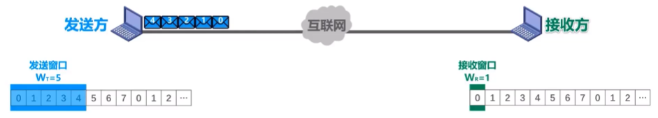 |
| $1$  | 接收方按序接收$01234$号数据分组                              | 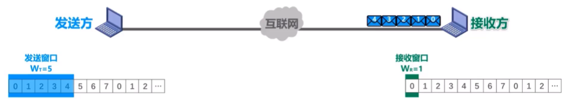 |
| $2$  | 接收方每接收一个数据分组，接收窗口向前滑动一个位置，并给发送方发送针对所接收分组的确认分组 | 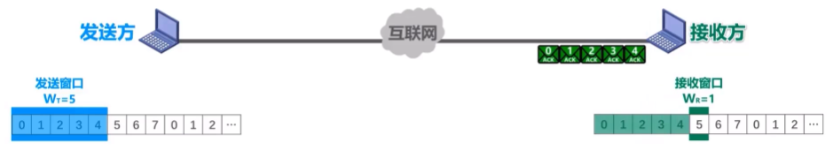 |
| $3$  | 发送方按序接收$01234$号数据分组确认分组                      | 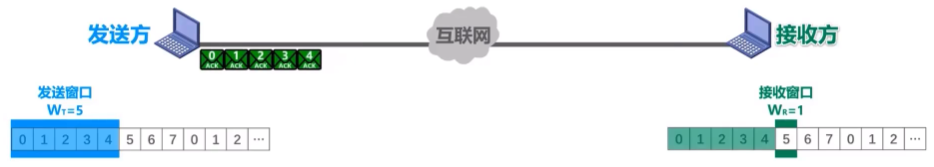 |
| $4$  | 发送方每接收一个数据分组的确认分组，发送窗口向前滑动一个位置。 | 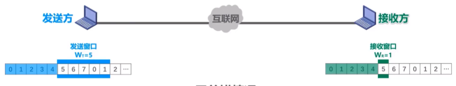 |
| $5$  | 发送方将删除缓存中已经收到确认的数据分组；接收方择机将已经接收的数据分组交付上层处理 | 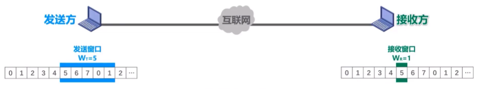 |

**累计确认**：接收方不一定要对收到的数据分组逐个发送确认，而是可以在收到几个数据分组后（由具体实现决定）对按序到达的最后一个数据分组发送确认。

> $ACKn$表示序号为$n$及以前的所有数据分组都已正确接收。

|      |                                                              |                     |
| ---- | ------------------------------------------------------------ | ------------------- |
| $0$  | 发送方将序号落在发送窗口内的$01234$号数据分组连续发送        | 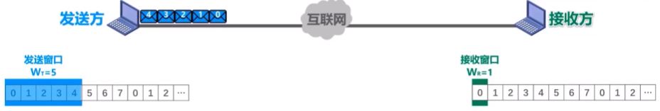 |
| $1$  | $01234$号数据分组依次到达接收方                              | 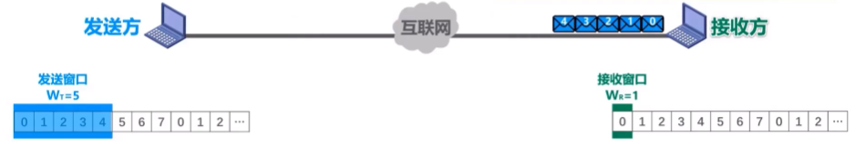 |
| $2$  | 接收方接收完数据分组$0$和$1$后，接收窗口向前滑动$2$个位置，并给发送方发送针对所接收的最后一个分组的确认分组$ACK1$ | 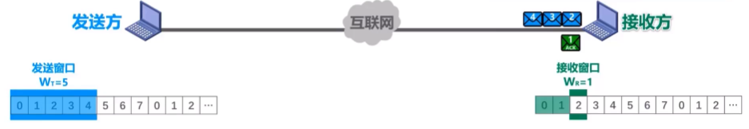 |
| $3$  | 接收方接收完数据分组$2$、$3$和$4$后，接收窗口向前滑动$3$个位置，并给发送方发送针对所接收的最后一个分组的确认分组$ACK4$ | 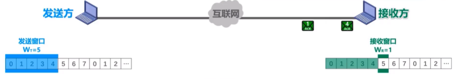 |
| $4$  | $ACK1$在传输过程中丢失                                       | 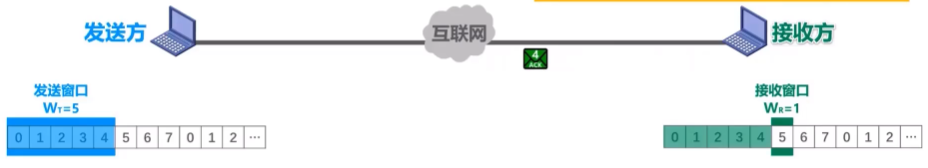 |
| $5$  | $ACK4$正常到达发送方                                         | 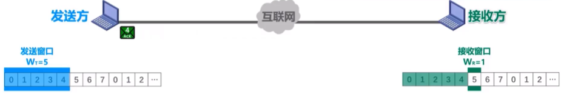 |
| $6$  | 发送方接收$ACK4$（序号为$4$及之前的数据分组已被接收方正确接收了），发送窗口向前滑动$5$个位置 | 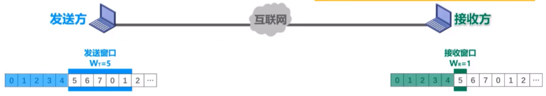 |
| $7$  | 发送方将删除缓存中已经收到确认的数据分组；接收方择机将已经接收的数据分组交付上层处理 | 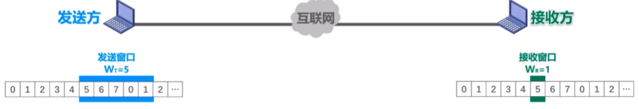 |

> 即使确认分组丢失，发送方也可能不必重传！同时减少接收方的开销、减少网络资源的占用。

- 有差错的情况

|      |                                                              |                     |
| ---- | ------------------------------------------------------------ | ------------------- |
| $0$  | 发送方将序号落在发送窗口内的$56701$号数据分组连续发送        | 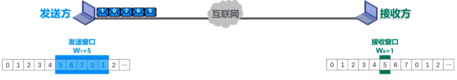 |
| $1$  | $56701$号数据分组依次到达接收方                              | 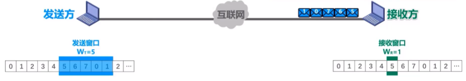 |
| $2$  | 接收方通过$5$号数据分组中的检错码发现了错误，丢弃该分组      | 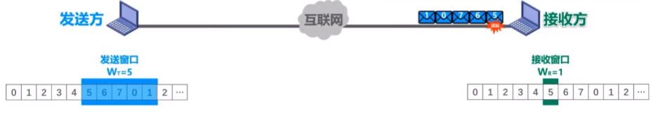 |
| $3$  | 接收方接收窗口序号与数据分组不匹配，丢弃其余分组             | 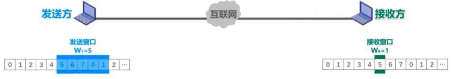 |
| $4$  | 接收方给发送方发送针对所接收的最后一个分组的确认分组$ACK4$（每丢弃一个发送一个） | 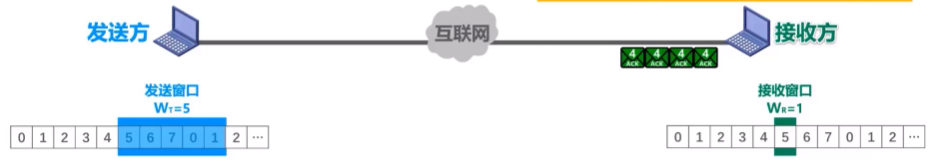 |
| 5    | $ACK4$正常到达发送方                                         | 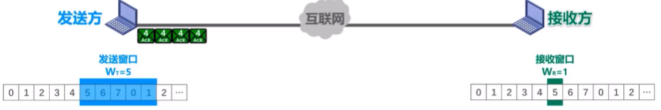 |
| 6    | 发送方接收$ACK4$，又因为序号为$4$及之前的数据分组已被接收方正确接收了，不等超时计时器超时就立刻开始重传（收到几个重复$ACK$开始重传由具体实现来决定） | 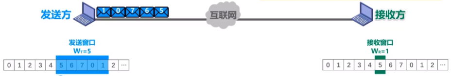 |

**回退N帧**：在本例中，尽管序号为$6.7.0.1$的数据分组正确到达接收方。但由于$5$号数据分组误码不被接受。它们也“受到牵连”而不被接受，发送方还要重传这些数据分组。

> 当通信线路质量不好时，回退$N$帧协议的信道利用率并不比停止-等待协议高。

*如果发送窗口尺寸$W_T$超过其取值范围上限？*

|      |                                                              |                     |
| ---- | ------------------------------------------------------------ | ------------------- |
| $0$  | 发送方将序号落在发送窗口内的$01234567$号数据分组连续发送     | 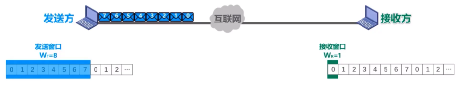 |
| $1$  | $01234567$号数据分组依次到达接收方                           | 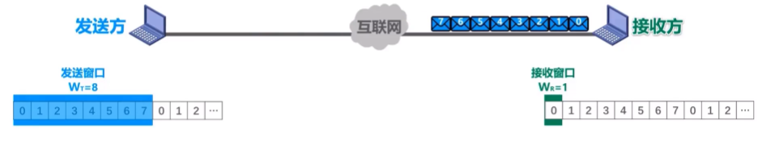 |
| $2$  | 接收方依次接收完数据分组$01234567$，后，接收窗口向前滑动$8$个位置，并给发送方发送针对所接收的最后一个分组的确认分组$ACK7$ | 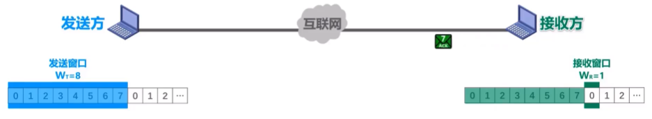 |
| $3$  | $ACK7$在传输过程中丢失                                       | 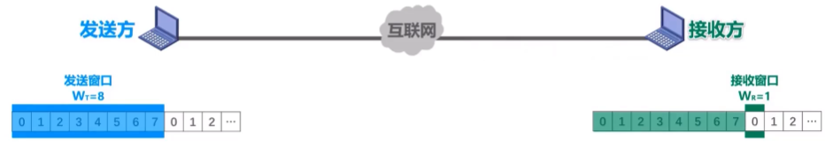 |
| $4$  | 超时计时器超时，发送方重传$01234567$号数据分组               | 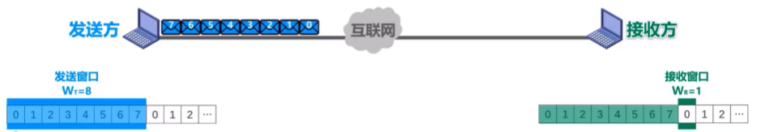 |
| $5$  | 重传的$01234567$号数据分组依次到达接收方                     | 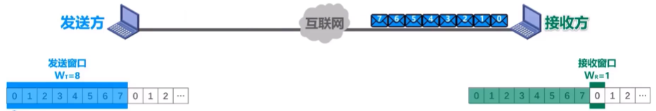 |
| $6$  | 接收方按序接收重传的$01234567$号数据分组                     | 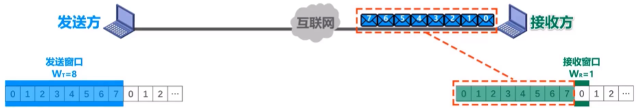 |

$\color{red}{接收方无法分辨新、旧数据分组！}$

【练习】数据链路层使用后退$N$帧$（GBN）$协议，发送方已经发送了编号为$0$到$7$的帧。当计时器超时时，若发送方只收到$0、2、3$号帧的确认，则发送方需要重发的帧数是（）

A. 2

B. 3

C. 4

D. 5

$C$

### 3.2.3 (4)可靠传输的实现机制-选择重传协议（SR）

$\color{red}{为了进一步提高性能，可设法只重传出现误码的数据分组。}$

1. 采用$3$个比特给分组编号
2. 发送窗口的尺寸$W_T$取值范围：$1<W_r \leq 2^3-1$，这里取$W_T=4$
3. 接收窗口的尺寸$W_R=4$

  

|      |                                                              |                     |
| ---- | ------------------------------------------------------------ | ------------------- |
| $0$  | 发送方将序号落在发送窗口内的$0123$号数据分组连续发送         | 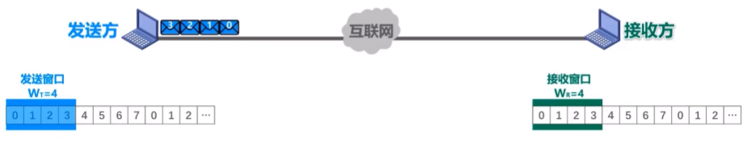 |
| $1$  | $0123$号数据分组依次到达接收方                               | 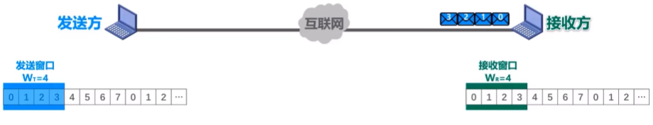 |
| $2$  | $2$号数据分组丢失                                            | 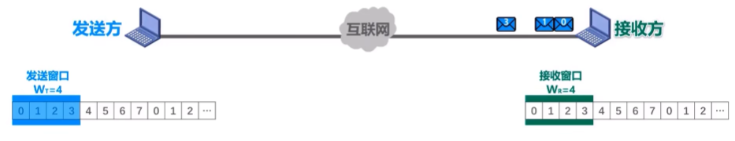 |
| $3$  | 接收方依次接收完数据分组$01$后，接收窗口向前滑动$2$个位置，并给发送方发送针对所接收分组的确认分组$ACK0$和$ACK1$ | 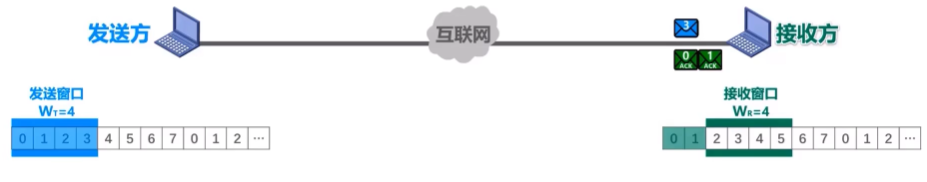 |
| $4$  | 接收方依次接收完数据分组$3$后，并给发送方发送针对所接收分组的确认分组$ACK3$ | 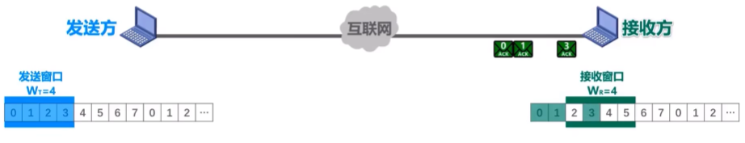 |
| $5$  | $ACK0$、$ACK1$和$ACK3$陆续到达发送方                         | 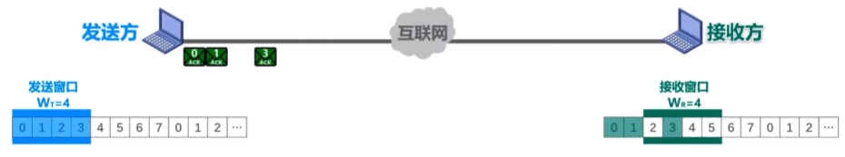 |
| $6$  | （接收方每接收完一个数据分组，接收窗口向前滑动$1$个位置）发送方依次接收完$ACK0$和$ACK1$后，发送窗口向前滑动$2$个位置 | 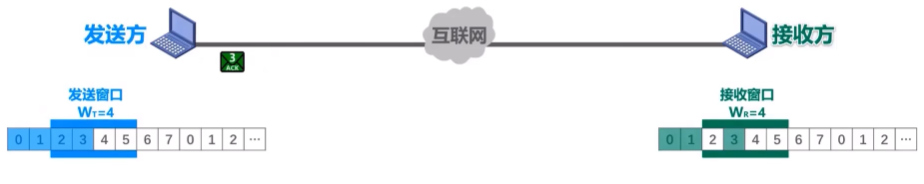 |
| $7$  | 发送方将序号落在发送窗口内的$45$号数据分组连续发送           | 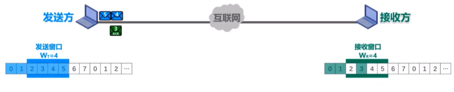 |
| $8$  | 发送方将删除缓存中已经收到确认的数据分组$01$；接收方择机将已经接收的数据分组$01$交付上层处理 | 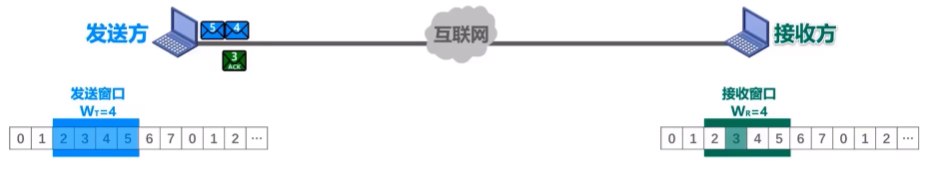 |
| $9$  | 发送方接收完$ACK3$，记录数据分组$3$已收到                    | 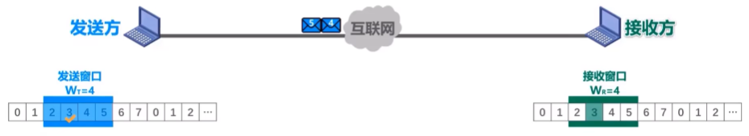 |
| $10$ | $45$号数据分组依次到达接收方                                 | 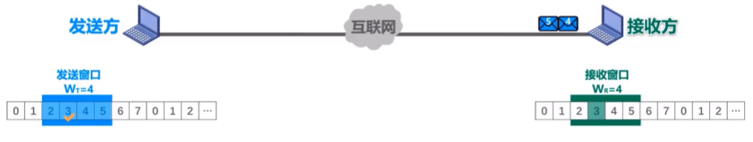 |
| $11$ | 接收方依次接收完数据分组$45$后，并给发送方发送针对所接收分组的确认分组$ACK4$和$ACK$5 | 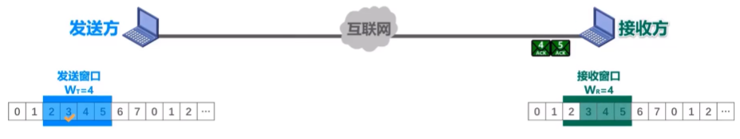 |
| $12$ | 超时计时器超时，发送方重传$2$号数据分组                      | 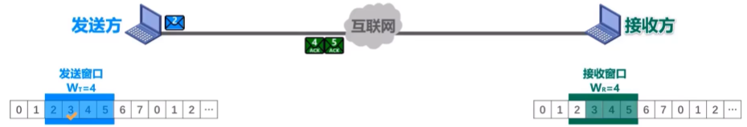 |
| $13$ | 发送方接收完$ACK4$和$ACK5$，记录数据分组$45$已收到           | 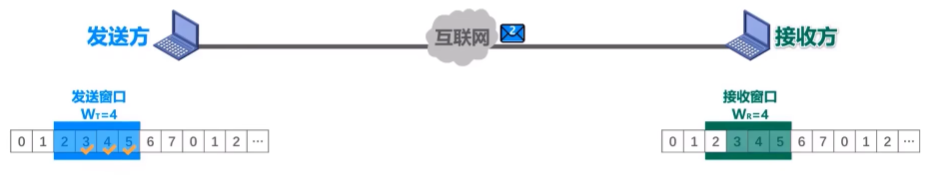 |
| $14$ | $2$号数据分组依次到达接收方                                  | 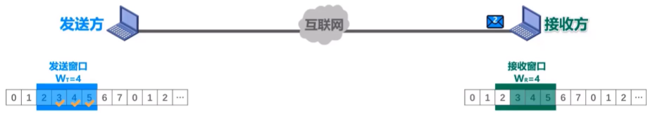 |
| $15$ | 接收方接收完数据分组$2$后，接收窗口向前滑动$4$个位置，并给发送方发送针对所接收分组的确认分组$ACK2$ | 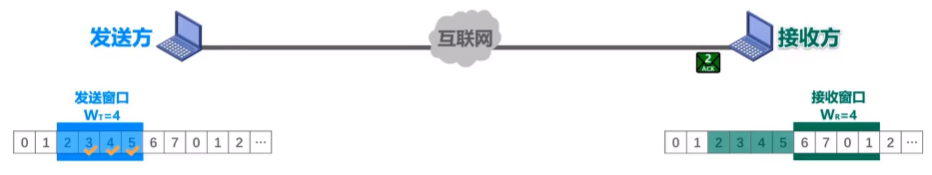 |
| $16$ | $ACK2$到达发送方                                             | 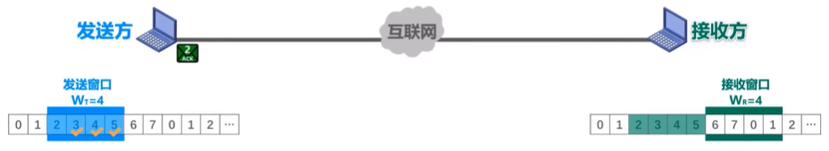 |
| $17$ | 发送方接收完$ACK2$，发送窗口向前滑动$4$个位置                | 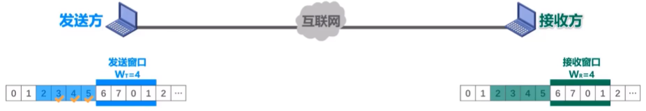 |
| $18$ | 发送方将删除缓存中已经收到确认的数据分组$012345$；接收方择机将已经接收的数据分组$012345$交付上层处理 | 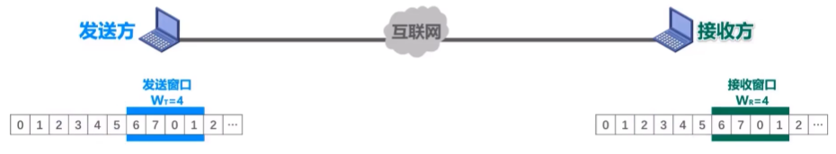 |

- 发送方发送窗口尺寸：$1<W_T \leq 2^{(n-1)}$
  - $W_T=1$，停止-等待协议
  - $W_T>2^{(n-1)}$，接收方无法分辨新，旧分组

- 接收方接收窗口尺寸：$1<W_R \leq W_T$
  - $W_R=1$，回退$N$帧协议
  - $W_R>W_T$，无意义

*如果发送窗口尺寸$W_T$以及$W_R$超过其取值范围上限？*

|      |                                                              |                     |
| ---- | ------------------------------------------------------------ | ------------------- |
|      | 发送方将序号落在发送窗口内的$01235$号数据分组连续发送        | 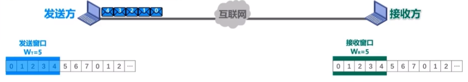 |
|      | $01234$号数据分组依次到达接收方                              | 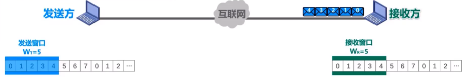 |
|      | 接收方依次接收完数据分组$01234$后，接收窗口向前滑动$5$个位置，并给发送方发送针对所接收分组的确认分组$ACK0$到$ACK4$ | 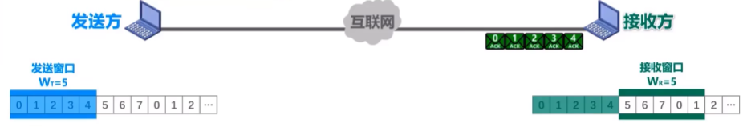 |
|      | 发送方接收完$ACK0$到$ACK4$，但$ACK0$丢失，记录数据分组$1234$已收到 |  |
|      | 超时计时器超时，发送方重传$0$号数据分组                      |  |
|      | 重传的$0$号数据分组到达接收方                                |  |
|      | 接收方接收重传的$0$号数据分组                                |  |

$\color{red}{接收方无法分辨新、旧数据分组！}$

【练习】数据链路层采用选择重传协议（$SR$）传输数据，发送方已发送了$0$到$3$号数据帧，现已收到$1$号帧的确认，而$0、2$号帧依次超时，则此时需要重传的帧数是（）

A. 1

B. 2

C. 3

D. 4

$B$

## 3.3 点对点协议PPP

使用场景：

  

**$PPP$协议**为在点对点链路传输各种协议数据报提供了一个标准方法，主要由以下三部分构成：

- 对各种协议数据报的封装方法；
- **链路控制层协议LCP**：用于建立、配置以及测试数据链路的连接；
- **网络控制协议NCPs**：其中每一个协议支持不同的网络层协议。

帧格式：

  

- **标志（Flag）字段**： $PPP$帧的定界符，取值为$0x7E$；

- **地址（Address）字段**：取值为$0xFF$，预留（目前没有什么作用）；

- **控制（Control）字段**：取值为$0x03$，预留（目前没有什么作用）；

- **协议（Protocol）字段**：指明帧的数据部分送交哪个协议处理；

  - 取值$0x0021$表示：帧的数据部分为$IP$数据报；

  - 取值$0xC021$表示：帧的数据部分为$LCP$分组；

  - 取值$0x8021$表示：帧的数据部分为$NCP$分组。

    

      
    

- **帧检验序列（FCS）**：$CRC$计算出的校验位。

$\color{green}{透明传输}$：$PPP$协议实现透明传输的方法取决于所使用的链路类型。

- 面向字节的异步链路：采用字节填充法。
  - 发送方处理：
    - 出现的每一个$7E$字节转变成2字节序列（$7D,5E$）；
    - 出现的每一个$7D$字节转变成2字节序列（$7D,5D$）；
    - 出现的每一个$ASCII$码控制字符（数值小于$0x20$的字符)，则在该字符前面插入一个$7D$字节，同时将该字符的编码加上$0x20$。
  - 接收方处理：进行反变换即可恢复出原来的帧的数据部分。
- 面向比特的同步链路：采用比特填充法。
  - 发送方处理：对帧的数据部分进行扫描（一般由硬件实现）。只要发现$5$个连续的比特$1$，则立即填充$1$个比特$0$。
  - 接收方处理：对帧的数据部分进行扫描（一般由硬件实现）。只要发现$5$个连续的比特$1$，就把其后的$1$个比特$0$删除。

$\color{green}{差错检测}$：采用$CRC$检验。

  

$$
C R C-C C I T T=X^{16}+X^{12}+X^5+1
$$

接收方每收到一个$PPP$帧，就进行$CRC$检验。

若$CRC$检验正确，就收下这个帧；反之，就丢弃这个帧。

> 使用$PPP$的数据链路层向上不提供可靠传输服务。

$\color{green}{工作状态}$：

  

## 3.4 共享式以太网

**以太网（Ethernet）**以曾经被假想的电磁波传播介质——**以太（Ether）**来命名。

1. 以太网最初采用无源电缆（不包含电源线）作为共享总线来传输帧，属于基带总线局域网，传输速率为$2.94Mb/s$。

  

$\color{green}{历史过程}$：

  

2. 以太网目前已经从传统的共享式以太网发展到交换式以太网，传输速率已经从$10Mb/s$提高到$100Mb/s$、$1Gb/s$甚至$10Gb/s$。

> 我们会首先介绍最早流行的传输速率为$10Mb/s$的共享式以太网的相关知识。

### 3.4.1 网络适配器和MAC地址

#### 网络适配器

要将计算机连接到以太网，需要使用相应的**网络适配器（Adapter）**。

> 网络适配器一般简称为“网卡”。

  

  

- $EEPROM$
- BootROM插槽
- 核心芯片
- PCI接口
- 网络隔离变压器
- RJ45网络接口

#### MAC地址

### 3.4.2 (1)CSMA/CD协议的基本原理

### 3.4.2 (2)共享式以太网的争用期、最小帧长和最大帧长

### 3.4.2 (3)共享式以太网的退避算法和信道利用率

### 3.4.3 使用集线器的共享式以太网

### 3.4.4 在物理层扩展以太网

### 3.4.5 在数据链路层扩展以太网(1)—网桥的主要结构和基本原理

### 3.4.5 在数据链路层扩展以太网(2)—透明网桥的自学习和转发帧的过程以及生成树协议STP

## 3.5 交换式以太网

### 3.5.1 以太网交换机

### 3.5.2 共享式以太网和交换式以太网的对比

## 3.6 以太网的MAC帧格式

### 3.7.1 虚拟局域网VLAN概述

### 3.7.2 虚拟局域网VLAN的实现机制

## 3.8 以太网的发展

### 3.9.1 802.11无线局域网的组成

### 3.9.2 802.11无线局域网的物理层

### 3.9.3 (1)802.11无线局域网的数据链路层——使用CSMA/CA协议（而不使用CSMA/CD协议）

### 3.9.3 (2)802.11无线局域网的数据链路层——CSMA/CA协议的基本工作原理

### 3.9.4 802.11无线局域网的MAC帧

